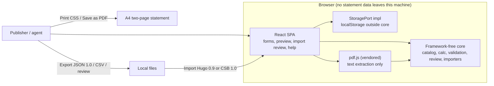
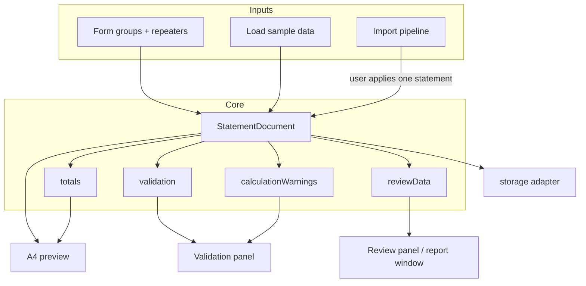
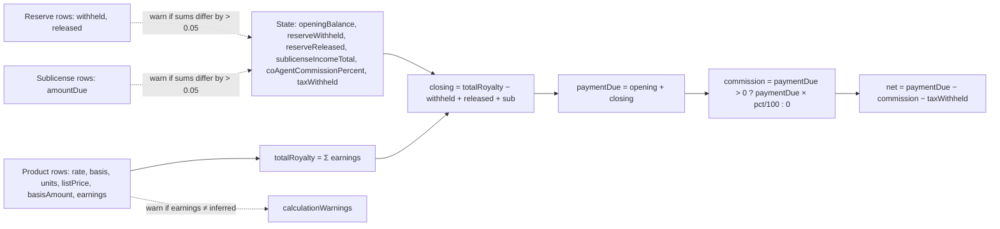
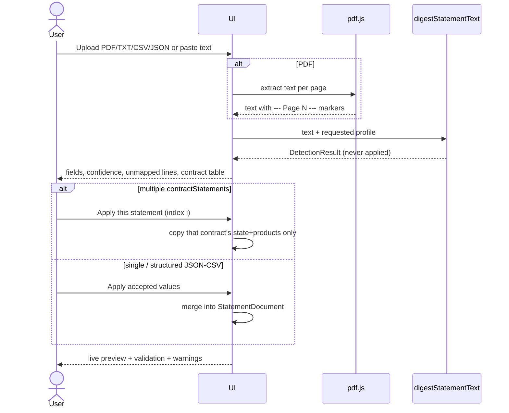

# Clear Statement Builder

**Product Requirements Document + Implementation Design**
**Reimplementation of Hugo prototype v1.7 (July 2026)**

| Field | Value |
|---|---|
| **Working name** | Clear Statement Builder |
| **Document type** | PRD + implementation design |
| **Status** | Draft |
| **Author** | TBD |
| **Date** | 2026-08-25 |
| **Audience** | Product owner and implementing engineers |
| **Source of truth (behavior)** | [`reference/hugo-prototype-v1.7.html`](file:///home/benr/git/quoinlock/clear-statement-builder/reference/hugo-prototype-v1.7.html) (Hugo prototype v1.7, July 2026; 1012 lines as checked in) |
| **Normative snapshot areas** | **Importer heuristics, A4 preview markup, Help/About copy, Profile Builder chrome, review-report HTML.** The PRD owns catalog, formulas, product rules, schema, and v1 deltas. Appendices A–F transcribe the snapshot-owned pieces so this file is usable; if appendix and snapshot diverge, **the snapshot wins** until an appendix is explicitly updated. |
| **Live prior art** | https://hugo-prototype.netlify.app/ |
| **BISG standard** | https://knowledgecenter.bisg.org/226a2o7/ (field IDs in this PRD are **Hugo `FIELD_META`**, not an independently enumerated Knowledge Center table) |
| **Repo** | `/home/benr/git/quoinlock/clear-statement-builder` (greenfield) |

This document is the first deliverable for a clean-room reimplementation. An engineer should implement catalog, math, validation, schema, and the labeled v1 deltas from this PRD, and should treat the frozen snapshot (plus Appendices A–F) as **normative** for importer regexes, preview layout, Help copy, Profile Builder, and report HTML. Features that exist in Hugo v1.7 are labeled **v1.7 parity**. Features that improve on the prototype are labeled **proposed improvement**. Product decisions that must not be silently invented are listed under **Open Questions**. Do **not** claim this PRD is a complete substitute for the snapshot on importer/preview/help.

---

## Overview

Clear Statement Builder is a **BISG-aligned translation-rights royalty statement tool**. It helps publishers, literary agents, and rights professionals **create, import, review, validate, and export** royalty statements whose fields map to the **44 alphanumeric IDs implemented in Hugo `FIELD_META`** (four Hugo categories: Required, Recommended, Conditional, Remittance). Those IDs are intended to track the BISG Translation Rights Royalty Statement Standard; this PRD does **not** independently verify the Knowledge Center document’s field table.

The product is a **clean-room reimplementation** of Hugo, a public single-file HTML/CSS/JS prototype built by BISG Rights Committee member Sebastian Ritscher (Mohrbooks Literary Agency) after comparing a real publisher statement with the BISG standard. Hugo proved the domain: a three-pane builder with live A4 preview, deterministic import/digest (including Ullstein/Bonnier Germany multi-contract PDFs), custom import profiles, calculation warnings, and a publisher-facing standards-completeness report.

Hugo is not a maintainable product: one frozen HTML file, no tests, hardcoded euro display, JSON `version` stuck at `0.9`, `innerHTML`-heavy rendering, and no production-grade accessibility. This reimplementation preserves **behavior and domain fidelity** while rebuilding as a TypeScript SPA with a framework-free, unit-testable core. v1 remains **privacy-first and browser-only**: statement, bank, tax, and sales data never leave the machine. It is **not** an official BISG product, **not** a certification tool, and **not** a production accounting system. There is **no backend, no analytics, no cdnjs at runtime**. Persistence is **unencrypted origin `localStorage`**; the OS user account is the confidentiality boundary.

---

## Problem statement and industry context

Reconciling incoming **translation-rights royalty statements** is a major, under-tooled industry pain. BISG Rights Committee work (2023–2026) found:

- **63%** of surveyed rights professionals receive **more than 100 statements/year**.
- **41 survey respondents** collectively spent an estimated **4.5 work-years** processing one year of statements.
- Real publisher statements often omit or obscure: advance amount, sales territory, list price, reserve activity, sublicense income, tax treatment, and payment reconciliation.
- Layouts vary wildly: languages, abbreviations (`NVE`, `NLP`, `BLP`, `ET`, `TB`), multi-book PDFs, German vs US number formats, and publisher-specific labels.
- The BISG standard **does not prescribe one visual layout**. It identifies the **information that should be present**, with alphanumeric field codes so fields remain identifiable across languages and templates. Hugo implements **44** such IDs in `FIELD_META`; until a committee spreadsheet or Knowledge Center extract is attached, treat “44 fields” as **Hugo’s catalog**, not as a recount of the official PDF.

Today the work is done in email, PDFs, spreadsheets, and tribal knowledge. Existing rights-management and royalty-accounting systems (see Competitive positioning) either:

- sit inside a publisher’s general ledger and emit opaque PDFs, or
- track contracts and deals without a BISG-coded, recipient-verifiable statement artifact.

Hugo demonstrated that the standard can be implemented as **(1) a data checklist, (2) a readable two-page statement, and (3) an exportable structured package** — without forcing publishers onto one accounting system. Clear Statement Builder turns that demonstration into a maintainable product that can continue to serve **standards discussion** and, if later approved, **production-adjacent local use**.

This is explicitly **not** a replacement for:

- publisher royalty accounting / ERP,
- agency rights databases,
- tax/legal advice,
- OCR of scanned image-only PDFs (v1),
- multi-tenant cloud storage of confidential statements (v1).

---

## Background & Motivation

### Current state (Hugo v1.7)

Hugo lives as a Netlify-hosted single HTML file with inline CSS, inline JS, and one CDN script (`pdf.js` 3.11.174). There is no published source repository, so this repo is **not a git fork**. A local snapshot is the implementation source of truth:

`/home/benr/git/quoinlock/clear-statement-builder/reference/hugo-prototype-v1.7.html`

Verified architecture of that snapshot:

| Aspect | v1.7 fact |
|---|---|
| Stack | Vanilla HTML/CSS/JS, no framework, no bundler, no TypeScript, no tests |
| Persistence | `localStorage` keys `bisgState`, `bisgProducts`, `bisgReserves`, `bisgSublicenses`, `bisgShowIds`, `hugoCustomImportProfiles`, `hugoCustomProfileDraft` |
| First visit | Sample data is the default (`readStored(..., sample)`), not an empty statement |
| JSON export `dataPackage().version` | `'0.9'` even though the UI badge says v1.7 |
| Currency display | `money()` hardcodes `€` |
| Dates | Free-text display strings (`15 Mar 2026`), not ISO |
| Import philosophy | Deterministic heuristics. Custom profiles are rule sets. **No LLM. No server.** |
| Review-before-apply | Hard product rule |
| Auth | None |

### Prototype version history (for background)

| Version | What shipped |
|---|---|
| v0.5 | Sample data, calculation warnings, demo mode, field IDs |
| v0.6 | First import/digest |
| v0.7 | Reviewable imports, confidence, unmapped lines, manual mapping |
| v0.8 | Ullstein split by `Interne VertragsNr.`, better tables |
| v0.9 | Help Center |
| v1.0 | Review my statement + BISG report exports |
| v1.1 | Report window, accordion nav, version history |
| v1.2 | Compact sidebar |
| v1.3 | Report-window generator fix |
| v1.4 | Statement Data as default section |
| v1.5 | Finalized nav order |
| v1.6 | Sidebar overlap fix (nav gets its own column) |
| v1.7 | Custom Import Profiles / Profile Builder |

### Why reimplement rather than keep the file

The prototype is the right **domain model** and the wrong **codebase**:

1. Untestable single-file app; formulas, Ullstein parser, and review scoring cannot be regression-tested. **v1 MUST improvement** (modular TS + tests).
2. JSON `version` stuck at `0.9`. **v1 MUST improvement** (write `1.0.0`, read `0.9`).
3. Euro hardcoded; advance currency is a field but statement currency is not first-class. **Open Question 4** (v1 default: euro display, no FX).
4. No OCR for scanned PDFs (acceptable v1 WON'T). Honest empty-text messaging is **v1 SHOULD**, not later.
5. One statement in `localStorage`; no multi-statement workspace. **Later.**
6. Opening-balance / payment-due semantics confuse non-accountants (negative unearned advance). **v1 SHOULD** explainer copy; formula unchanged.
7. Net-remitted warning is tautological (`t.net` is defined as the same expression it is checked against). **v1 SHOULD** (real Vortrag / Auszahlung identity; owner = PR 13).
8. Help PDF/PNG assets 404 on the live site. **v1 MUST improvement** (in-app Help; Appendix D).
9. No automated tests. **v1 MUST improvement.**
10. `innerHTML`-heavy rendering; `esc()` exists but does not escape `'`, and some paths interpolate into `onclick="..."`. **v1 MUST improvement** (React text nodes).
11. No i18n of the UI (importer handles DE/EN labels). **Later.**
12. Default-loads sample data (privacy/demo confusion). **Open Question 3.** Until answered: `firstVisitMode=sample`, flag-switchable (Hugo parity).
13. Accessibility is partial (help dialog has `role="dialog"`; most dynamic UI does not). **v1 SHOULD** (non-blocking). XSS-safe rendering is MUST; a11y polish is not.
14. No statement-currency vs advance-currency FX handling. **Open Question 4 / later.**
15. Ullstein prior/LTD units hardcoded to `01.01.2025` / `31.12.2025`. **v1 MUST bugfix:** generalize to `honorarpflichtige Menge Gesamt per\s+\d{2}\.\d{2}\.\d{4}`.

The single DoD list is the **MoSCoW table** later in this document (parity MUST / v1 MUST improvements / v1 SHOULD). Do not treat SHOULD as required.

---

## Users / personas

### Primary — Rights / royalties manager at a licensee publisher

Prepares outgoing translation-rights statements (or restates an internal extract into a BISG-shaped document). Needs a two-page PDF that a foreign agent can actually reconcile, plus JSON/CSV for their own files. Cares about product-form rows, reserves, advances, and not leaking data to a cloud vendor.

### Primary — Literary agent / sub-agent receiving statements

Receives 100+ PDFs a year, often in German, often multi-title. Needs to **digest** a publisher PDF, split by internal contract number, map unmapped lines, and produce a completeness report to send back (“your statement is missing sales territory and advance”). Does **not** want statement text uploaded to an LLM or SaaS.

### Secondary — Licensor / rights holder (author estate, original publisher)

Wants to understand whether a statement is complete enough to verify. Uses the review report more than the builder. Needs formula transparency, not another black-box total.

### Secondary — BISG Rights Committee / standards participant

Uses the tool as a **discussion artifact**: “this is what a fully populated statement looks like; this is the field catalog; this is what Ullstein-style intake can already detect.” Must not be told the tool is BISG-certified.

### Anti-persona

Production accountants posting live royalties into a general ledger; users who need OCR of faxed scans; users who need SSO and multi-tenant cloud storage in v1.

---

## Jobs to be done

1. **When** I am issuing a translation-rights statement, **I want** to enter contract, product, reserve, sublicense, and remittance data into a structured form **so that** the output is a two-page A4 statement a recipient can verify against the BISG field list.
2. **When** I receive a publisher PDF/TXT/CSV, **I want** a deterministic digest with confidence labels **so that** I can apply one contract’s data without silently trusting the parser.
3. **When** a PDF contains several Ullstein `Interne VertragsNr.` blocks, **I want** to apply **one contract at a time** **so that** I do not merge unrelated titles into one statement.
4. **When** my publisher’s layout is not Ullstein, **I want** a shareable, browser-local custom profile (regex + aliases, no LLM) **so that** the next statement from that publisher is faster to map.
5. **When** I am about to send a statement, **I want** a required-field completeness score and calculation warnings **so that** I catch missing territory/advance and rate×basis mismatches.
6. **When** I am pushing a publisher to improve, **I want** a plain-language review report (HTML/JSON/CSV) **so that** I can say “these High-priority fields are Missing” without claiming an audit.
7. **When** I handle confidential royalty, tax, and bank data, **I want** the data to stay in this browser **so that** I am not the person who uploaded an author’s earnings to a server.

---

## Competitive / prior-art positioning

| Prior art | What it is | Relationship to this product |
|---|---|---|
| **Hugo prototype v1.7** | Public browser prototype: builder + importer + review report. Contact: sebastian.ritscher@mohrbooks.com. Live: https://hugo-prototype.netlify.app/ | **Direct prior art.** We reimplement behavior; we do not claim to *be* Hugo; we credit it. |
| **BISG Translation Rights Royalty Statement Standard** | Identifies information that should be present; does not prescribe layout. https://knowledgecenter.bisg.org/226a2o7/ | **Interoperability layer.** We keep the **44 Hugo `FIELD_META` IDs** and four Hugo categories. We are not an official BISG product and have not independently enumerated the Knowledge Center table. |
| **Publisher royalty / ERP modules** (SAP, Klopotek, BiblioS, Vista, in-house) | Source of truth for units and money inside the licensee. Emit idiosyncratic PDFs. | Upstream. We ingest their PDFs; we do not replace the ledger. |
| **Agency rights systems** (e.g. deal/contract databases, royalty trackers) | Track licenses, advances, and expected rates. | Adjacent. JSON/CSV export is the intended bridge; no v1 integration. |
| **Generic PDF extractors / LLM document AI** | High recall, non-deterministic, data leaves the building. | Explicitly rejected for v1 custom profiles (Hugo: “They do not use an LLM and they do not send statement data to a server.”). |
| **Spreadsheet templates** | What most agents actually use today. | CSV export must remain round-trippable enough to feed Excel. |

Positioning sentence: **Clear Statement Builder is a local, BISG-coded statement workbench — not an accounting system, not a cloud rights platform, and not a BISG certification mark.**

---

## Goals & Non-Goals

### Goals (v1)

- Preserve Hugo v1.7 **behavior and domain fidelity** (field catalog, formulas, Ullstein split, custom profiles, review report, A4 print).
- Rebuild as a **maintainable, testable, modular** TypeScript codebase.
- Keep **privacy-first, client-side, deterministic-import** philosophy unless a later product decision says otherwise.
- Independent branding (working name Clear Statement Builder) with explicit credit to Hugo / Sebastian Ritscher / BISG as prior art.
- Produce a JSON schema **versioned at 1.0** with import compatibility for Hugo `dataPackage` `0.9`.
- Ship automated tests for core math, validation, Ullstein golden fixtures, and custom-profile application.

### Non-goals (v1)

- Accounts, auth, SSO, multi-tenant SaaS, or **any server-side storage of statement data**.
- LLM-based extraction.
- Claiming BISG certification, approval, or audit opinions.
- OCR of scanned/image-only PDFs.
- Multi-statement workspace / statement library (one active statement, plus import-apply of one contract at a time — same as Hugo).
- Full UI i18n (importer remains bilingual DE/EN as in v1.7).
- Foreign-exchange conversion between advance currency and statement currency.
- Production payroll/tax filing, payment initiation, or bank APIs.
- Being a git fork of Hugo (there is no published source repo to fork).

### Non-goals (explicitly later, not v1)

- Desktop/Electron packaging (see Open Question 2).
- Additional first-class publisher profiles beyond Ullstein + generic + custom (see Open Question 6).
- Cloud sync, collaboration, or “send this report to the publisher” email.
- Official BISG co-branding (see Open Question 5).

---

## Key Decisions

These are implementation and product decisions **this document does make**. They are not Open Questions. Rationale is short; details follow in Proposed Design.

1. **Browser-first SPA, no backend in v1.** Statement, bank, tax, and sales data must not leave the browser. Matches Hugo’s privacy notice and the industry sensitivity of royalty files. Server-side storage is a later decision, not a silent default.

2. **TypeScript + React + Vite for the UI; domain logic in a framework-free core.** React is recommended for hiring pool, Testing Library, and a later optional Electron shell. The core (`src/core`) must be importable from Node test runners with **zero DOM**. Vue or Svelte would also work; see Alternatives.

3. **Deterministic importers as pure functions: `text + profile + customProfiles? → DetectionResult`.** pdf.js is used only to produce text. Digest must not read `localStorage` or `window`. **No backend, no analytics, no cdnjs** during digest. Custom profiles remain rule sets, not models. JSON/CSV structured files still land as a `DetectionResult`; **Apply is required** (no skip-review, no auto-apply on drop).

4. **Review-before-apply is a hard product rule.** Multi-contract Ullstein (or custom-split) intakes cannot be applied with the bulk “Apply” button; the user must pick one `Interne VertragsNr.` (or split block) at a time. Optional **proposed improvement**: confirm modal “Replace current statement?” — not skip-review.

5. **JSON interchange field is `version` (`1.0.0` write, `0.9` read).** Matches Hugo `dataPackage().version`. In-memory types use the same `version` field (not a separate `schemaVersion`). `showIds` is a **persistence-only** key, not a JSON document field. Review payload uses `reviewFormatVersion: '1.1'` (Hugo’s `reviewData().version` was `'1.1'` and is **not** the statement schema). Hugo JSON/CSV and `{hugoProfileVersion:'1.7', profiles:[...]}` remain readable.

6. **Working product name is Clear Statement Builder.** In-app we do not pretend to be Hugo or BISG. Hugo is credited as prior art on About, Help, and the printed disclaimer. Shorter wordmarks are an Open Question, not a unilateral rename.

7. **Keep BISG field IDs and categories as the interoperability layer.** Internal keys (`licenseeName`, etc.) stay Hugo-compatible so 0.9 JSON round-trips. Display labels may be retitled; IDs such as `Con61_SalesTerr` and `SS92_PayDue` do not change.

8. **Do not claim certification.** Review copy must retain: “standards-completeness review only. It is not an audit, certification, legal opinion, or accounting advice.” The A4 preview subtitle must **not** copy Hugo’s “Example of a BISG-compliant publisher royalty statement.” Use an explicit non-certification string (see F4). Do not put the BISG logo or wordmark in the app bar until Open Question 5.

9. **Vendor `pdf.js` (do not depend on cdnjs at runtime).** **Proposed improvement.** Hugo loads `https://cdnjs.cloudflare.com/ajax/libs/pdf.js/3.11.174/pdf.min.js`. A privacy-first app should not fetch a parser from a third-party CDN when the user opens a confidential PDF. Pin 3.11.174 or a later 3.x that preserves `getDocument` + `getTextContent` behavior; cover with a fixture test.

10. **`StoragePort` interface + in-memory fake live in `src/core`; the `localStorage` implementation lives outside core (`src/persist` or `src/ui`).** One active statement in v1. IndexedDB is allowed later without rewriting call sites. Do not store uploaded PDF binaries. Vitest core tests must not touch `window`. **Clear all** wipes statement + `showIds` keys only — **not** custom profiles (Hugo `STORAGE_KEYS` parity).

11. **Vitest for core; golden-file Ullstein text fixtures; React Testing Library for critical UI.** No v1 requirement for full Playwright coverage; a small smoke is **SHOULD**.

12. **Euro display remains the v1 default for parity**, unless Open Question 4 decides otherwise before implementation. Advance currency stays a separate field. Do **not** silently invent FX.

13. **Sample data remains available via “Load sample data”.** Open Question 3 is unanswered. **Until OQ3 is answered, default `firstVisitMode=sample` (Hugo `readStored(..., sample)` parity), flag-switchable** — same pattern as euro display until OQ4. The normative fixture is the snapshot `sample` / `sampleProducts` / `sampleReserves` / `sampleSublicenses` objects (Appendix B).

14. **Render with React (no `innerHTML` of imported text).** **Proposed improvement** addressing Hugo XSS risk. `esc()`-style escaping is not enough once custom profile IDs and unmapped lines are interpolated.

15. **Help content is in-app.** Do not depend on Hugo’s `assets/Hugo_Quick_Guide.pdf` (404 on the live site). **Proposed improvement:** recreate the eight Help Center tabs as first-party copy, still crediting Hugo.

---

## Domain glossary

| Term | Meaning in this product |
|---|---|
| **Licensee** | The publisher who licensed translation rights and typically issues the statement (`Con1_LicName`). |
| **Licensor** | The rights holder or their agent receiving the statement (`Con31_LicensorName`). |
| **Payer** | Party that remits, if different from licensee (`Con16_PayName`). Conditional. |
| **Imprint** | Publishing imprint of the licensed edition (`Con11_LicImp`). Recommended. |
| **Contributor** | Author/creator names, optionally with ISNI (`Con41_ContribNames`). |
| **Licensor title** | Original-language work title (`Con46_LicensorWorkTitle`). |
| **Licensee title** | Translated/local title (`Con51_LicWorkTitle`). |
| **Sales territory** | Market in which reported sales occurred (`Con61_SalesTerr`). |
| **Advance** | Amount paid against which royalties recoup (`Con66_AdvAmount` + `Con71_AdvCurr`). Shown separately from statement currency. |
| **Opening balance** | Carry-forward into this period (`SS17_OpenBal`). In translation-rights practice this is often a **negative unearned advance**. |
| **Prior units** | Net units to beginning of period (`SS22_NetUnitstoBegPer`). |
| **Period units** | Units sold in the reporting period (`SS57_UnitsSldinPer`). |
| **LTD units** | Life-to-date units = prior + period (`SS72_LTDUnitsSold`). Computed. |
| **Royalty basis** | What the rate applies to (`SS52_RoyBasis`): typically list price or net receipts (Ullstein: NLP / NVE). |
| **Basis amount** | Hugo-extended product field: the numeric base used in the earnings formula (per-copy or period total). Not a BISG ID. |
| **Royalty earnings** | Period earnings for one product form (`SS62_RoyEarnings`). |
| **Total royalty earnings** | Sum across product forms (`SS67_TotRoyEarnings`). Computed. |
| **Reserve withheld / released** | Amounts held back against returns, and prior reserves released (`SS77`, `SS82`). |
| **Closing balance** | Current-period activity result (`SS87_ClosingBal`). Computed. |
| **Payment due** | `Opening + Closing` (`SS92_PayDue`). **May be negative** if the advance is still unearned — meaning no payment, not a refund UI. |
| **Co-agent commission** | Percentage of Payment Due, applied **only if Payment Due > 0** (`RA9_CoAgentCommPerc`). |
| **Net remitted** | `Payment Due − commission − tax withheld`. Hugo-extended computed field (no BISG ID in `FIELD_META`). |
| **Sublicense income** | Conditional block (`SC3`–`SC23`) when subsidiary rights income exists. |
| **Remit ID** | Payment-matching string (`RA4_RemitIDInfo`). In Hugo computed as `licensorContractId \| contributor (before " (") \| licensorTitle \| statementNo`. |
| **BISG category** | Required, Recommended, Conditional, or Remittance. |
| **Completeness score** | Percent of **Required** checks that are non-blank. Presence, not semantic correctness. |
| **Review score** | Average of per-category scores, where Detected = 1, Detected but unclear = 0.5, Missing = 0, N/A excluded. |
| **DetectionResult** | Importer output: candidate fields + confidence + unmapped lines + optional contract splits. Never auto-applied. |
| **Profile** | `auto` \| `ullstein` \| `generic` \| `custom:<id>`. |
| **Hugo-extended field** | Form field persisted in state but **without** a BISG ID (statement number, phone/email/website, bank details, notes, etc.). |

---

## Proposed Design

### High-level architecture



Recommended repository layout (single Vite app, extractable core — not a multi-package monorepo in v1):

```
clear-statement-builder/
  docs/PRD.md                          ← this document
  reference/hugo-prototype-v1.7.html   ← frozen prior art
  src/
    core/                              ← no React, no DOM
      catalog/                         ← FIELD_META, groups, REVIEW_FIELD_DETAILS
      calc/                            ← totals, expectedProductEarnings, warnings
      validation/                      ← presence checks + score
      review/                          ← reviewRows, categoryScores, reviewData
      import/                          ← digest, ullstein, csv, json, custom profiles
      sample/                          ← fictional Nordlicht / Cedar Lane fixture
      schema/                          ← version, migrateHugo09, serialize
      persist/                         ← StoragePort interface + in-memory fake only
      types.ts
    persist/                           ← localStorage StoragePort impl (may use window)
    ui/
      app/                             ← shell, nav, app bar
      statement/                       ← form groups + repeaters
      preview/                         ← two A4 pages
      import/                          ← digest review UI
      profiles/                        ← profile builder
      validation/
      review/
      help/
      theme.css                        ← design tokens
    pdf/
      extractText.ts                   ← wraps pdf.js
  test/
    core/                              ← Vitest
    fixtures/ullstein/                 ← golden .txt extracts
    fixtures/hugo/                     ← 0.9 JSON/CSV samples
  public/
  index.html
  package.json
  vite.config.ts
  vitest.config.ts
```

`src/core` must not import `react`, `document`, or `window`. `StoragePort` (interface + memory fake) lives in `src/core/persist`. The `localStorage` implementation lives in `src/persist` (or `src/ui`) and is injected by the UI. Digest takes `customProfiles?` as an argument; it does not read storage.

### Application shell (v1.7 parity)

Sticky app bar + three-column shell + Help modal.

```
┌──────────────────────────────────────────────────────────────────────────┐
│ App bar (sticky): title + version badge + subtitle                       │
│ [Clear all] [Load sample] [JSON] [CSV] [Import] [Review] [Help] [Print]  │
├─────────────┬──────────────────────────┬─────────────────────────────────┤
│ Left nav    │ Selected form panel      │ Live two-page A4 preview        │
│ 260px       │ 500px                    │ minmax(0,1fr)  pages 794×1123   │
│ one section │                          │                                 │
└─────────────┴──────────────────────────┴─────────────────────────────────┘
```

Nav order (**v1.7 parity**, titles from `setupSideNavigation` / `preferredOrder`):

1. Statement data (**default** on load)
2. Product rows
3. Reserve rows
4. Sublicense rows
5. Import / digest
6. Custom import profiles
7. Validation
8. Review my statement
9. About (rebranded; credits Hugo)
10. Version history

Below **1250px**, shell collapses to one column; nav is static; preview remains scrollable. Help modal below **900px** stacks nav/content.

### Runtime data flow



### Calculation data flow



### Import sequence (hard rule: review before apply)



### Component boundaries

| Module | Responsibility | Must not do |
|---|---|---|
| `core/catalog` | `FIELD_META`, labels, groups, badges, Hugo-extended key list | Know about React |
| `core/calc` | `totals`, `expectedProductEarnings`, `calculationWarnings`, `roughlyEqual` | Read `localStorage` |
| `core/validation` | Presence checks + required % | Invent semantic ISBN checks in v1 (parity = presence only) |
| `core/review` | Status, category scores, report DTO, why-it-matters copy | Open windows |
| `core/import` | Profiles, Ullstein, generic, CSV, JSON, custom rules | Call pdf.js or `window` |
| `core/schema` | Serialize `version: '1.0.0'`, migrate Hugo `0.9` | Change field IDs; include `showIds` in JSON |
| `core/persist` | `StoragePort` + memory fake | Touch `localStorage` / `window` |
| `persist/` or `ui/persist` | localStorage adapter | Live in `src/core` |
| `pdf/extractText` | File → string | Interpret royalty semantics |
| `ui/*` | Rendering, files, print, help | Duplicate formulas |

---

## API / Interface Changes

There is no HTTP API in v1. The “API” is the **core TypeScript surface** and the **file interchange formats**.

### Core types (normative)

```ts
export type BisgCategory = 'Required' | 'Recommended' | 'Conditional' | 'Remittance';
export type Confidence = 'High' | 'Medium' | 'Low';
export type ReviewStatus =
  | 'Detected'
  | 'Detected but unclear'
  | 'Missing'
  | 'Not applicable / not shown';

export interface ProductRow {
  form: string;
  isbn: string;
  pubDate: string;
  listPrice: string;
  basis: string;
  rate: string;
  priorUnits: string;
  periodUnits: string;
  basisAmount: string; // Hugo-extended
  earnings: string;
}

export interface ReserveRow {
  form: string;
  rate: string;
  withheld: string;
  released: string;
}

export interface SublicenseRow {
  name: string;
  type: string;
  income: string;
  share: string;
  amountDue: string;
}

/** Keys match Hugo `state` so 0.9 JSON round-trips. */
export interface StatementState {
  statementNo: string;            // Hugo-extended
  statementDate: string;          // SS2_RoyStmntDate
  periodStart: string;            // SS7_RoyRptStartDt
  periodEnd: string;              // SS12_RoyRptEndDt
  preparedBy: string;             // Hugo-extended
  licenseeName: string;
  licenseeImprint: string;
  licenseeAddress: string;
  licenseePhone: string;          // Hugo-extended
  licenseeEmail: string;          // Hugo-extended
  licenseeWebsite: string;        // Hugo-extended
  payerName: string;
  payerAddress: string;
  payerPhone: string;             // Hugo-extended
  payerEmail: string;             // Hugo-extended
  payerWebsite: string;           // Hugo-extended
  licenseeContractId: string;
  licensorName: string;
  licensorContractId: string;
  contributorNames: string;
  licensorTitle: string;
  licenseeTitle: string;
  language: string;
  salesTerritory: string;
  advanceAmount: string;
  advanceCurrency: string;
  openingBalance: string;
  reserveWithheld: string;
  reserveReleased: string;
  sublicenseIncomeTotal: string;  // Hugo-extended rollup of SC23
  coAgentCommissionPercent: string;
  taxId: string;
  taxExemptionStatus: string;
  taxWithheld: string;
  scheduledPaymentDate: string;   // Hugo-extended
  paymentMethod: string;          // Hugo-extended
  beneficiary: string;            // Hugo-extended
  beneficiaryBank: string;        // Hugo-extended
  swiftBic: string;               // Hugo-extended
  accountReference: string;       // Hugo-extended
  statementNotes: string;         // Hugo-extended
}

export interface Totals {
  totalRoyalty: number;
  opening: number;
  withheld: number;
  released: number;
  sub: number;
  closing: number;
  payment: number;
  commission: number;
  net: number;
}

/** In-memory working document. `showIds` is UI/persistence only — not written to statement JSON. */
export interface StatementDocument {
  version: '1.0.0';
  generatedAt: string; // ISO-8601
  product?: 'clear-statement-builder';
  priorArt?: 'hugo-prototype-v1.7';
  state: StatementState;
  products: ProductRow[];
  reserves: ReserveRow[];
  sublicenses: SublicenseRow[];
}

export interface UiPersistence {
  showIds: boolean;
  firstVisitMode: 'sample' | 'empty';
}

export interface Detection {
  target: keyof StatementState | string;
  value: string;
  confidence: Confidence;
  source: string;
  reason: string;
  bisg: string;
  category: string;
}

export interface CalcInference {
  product: string;
  calculation: string;
  reported: string;
  status: 'matches' | 'review';
}

export interface ContractStatement {
  contractId: string;
  title: string;
  state: Partial<StatementState>;
  products: ProductRow[];
  sourceText?: string;
  openingBalance: string;
  currentRoyalty: string;
  newBalance: string;
}

export interface DetectionResult {
  sourceType: string;
  profile: string;
  state: Partial<StatementState>;
  products: ProductRow[];
  reserves: ReserveRow[];
  sublicenses: SublicenseRow[];
  detections: Detection[];
  unmappedLines: string[];
  calcInferences: CalcInference[];
  notes: string[];
  rawText?: string;
  contractStatements?: ContractStatement[];
}

export interface CustomImportProfile {
  id: string;
  name: string;
  language: string;
  numberFormat: 'auto' | 'european' | 'us';
  splitPattern: string;
  fieldRules: string;
  abbreviations: string;
  productAliases: string;
  calculationHint: string;
}
```

### Normative core functions (signatures)

```ts
totals(state: StatementState, products: ProductRow[]): Totals;
expectedProductEarnings(p: ProductRow): number | null;
calculationWarnings(state, products, reserves, sublicenses): {label: string; detail: string}[];
validation(state, products, sublicenses): {checks: Check[]; score: number};
reviewData(input): ReviewDocument; // reviewFormatVersion 1.1 payload, not statement version
digestStatementText(text: string, profile: ProfileId, customProfiles?: CustomImportProfile[]): DetectionResult;
parseImportedCsv(csv: string): DetectionResult;
parseHugoOrCsbJson(obj: unknown): StatementDocument; // accepts version 0.9 or 1.0.0
serializeDocument(doc: StatementDocument, extras?: {totals, validation, calculationWarnings}): object;
```

### File interchange

#### Statement JSON (write)

```json
{
  "version": "1.0.0",
  "generatedAt": "2026-08-25T12:00:00.000Z",
  "product": "clear-statement-builder",
  "priorArt": "hugo-prototype-v1.7",
  "state": {},
  "products": [],
  "reserves": [],
  "sublicenses": [],
  "totals": {},
  "validation": {},
  "calculationWarnings": []
}
```

**Hugo 0.9 read path:** if `version === '0.9'` **or** (`version` is missing/unknown **and** `product` is missing) and `state`/`products` exist, accept as Hugo `dataPackage`. A hand-edited CSB file that forgot `product` is therefore treated as Hugo 0.9; that is acceptable (state/products still load; extras like `priorArt` are ignored). Do not require `generatedAt`. Never write `showIds` into statement JSON.

**Write filenames:** `clear-statement-{statementNo||'draft'}.json` and `.csv`. Still **read** files named `hugo-royalty-statement-*.json`.

#### Statement CSV (v1.7 parity)

Header: `Section,Field,Value,BISG ID,Category`

- `Statement,<stateKey>,<value>,<id>,<cat>`
- `Product {n},<productKey>,...`
- `Reserve {n},...`
- `Sublicense {n},...`

Quoted RFC4180 (`"` doubled). Generic CSV that does not match this header is **not** auto-mapped; it becomes unmapped lines (Hugo behavior).

#### Custom profiles JSON

**Write:**

```json
{
  "csbProfileVersion": "1.0",
  "hugoProfileVersion": "1.7",
  "profiles": [ { "id": "...", "name": "...", "...": "..." } ]
}
```

**Read:** `{hugoProfileVersion:'1.7', profiles:[...]}` **or** a bare array **or** `{profiles:[...]}` (Hugo `importCustomProfilesFile`).

#### Review JSON

Write `"reviewFormatVersion": "1.1"` (Hugo called this `reviewData().version === '1.1'` — it is **not** the statement `version`). Keep the rest of the payload shape so existing review CSV consumers still work (`overallScore`, `fields`, `disclaimer`). Add `"product": "clear-statement-builder"`. When **reading** a Hugo review JSON that has `"version": "1.1"` and no `reviewFormatVersion`, treat `version` as the review format, not as a statement schema.

---

## Data Model Changes

### In-memory document

One `StatementDocument` plus ephemeral UI state (`activeNav`, `activeFormTab`, `detectedImport`, `customProfileDraft`).

Empty product/reserve/sublicense after **Clear all fields** (**v1.7 parity**):

- products: one row of empty strings (not zeros)
- reserves: one empty row
- sublicenses: one empty row

**Add row** buttons use zeros for numeric-ish fields (**v1.7 parity**):

- product: `listPrice:'0', rate:'0', priorUnits:'0', periodUnits:'0', earnings:'0'`
- reserve: `withheld:'0', released:'0'`
- sublicense: `income:'0', share:'0', amountDue:'0'`

This empty-vs-zero inconsistency is preserved for parity; a **proposed improvement** is to use empty strings on add as well, so new rows do not inflate totals until filled. Flag it in UI copy if implemented; default is parity.

### Persistence

Split **statement keys** vs **profile keys**. Hugo `STORAGE_KEYS` is only `bisgState`, `bisgProducts`, `bisgReserves`, `bisgSublicenses`, `bisgShowIds` — **custom profiles survive Clear all**.

**Statement keys** (cleared by Clear all):

| Hugo key | CSB adapter key | Payload |
|---|---|---|
| `bisgState` | `csb.v1.state` | `StatementState` |
| `bisgProducts` | `csb.v1.products` | `ProductRow[]` |
| `bisgReserves` | `csb.v1.reserves` | `ReserveRow[]` |
| `bisgSublicenses` | `csb.v1.sublicenses` | `SublicenseRow[]` |
| `bisgShowIds` | `csb.v1.showIds` | boolean |

**Profile keys** (NOT cleared by Clear all; deleted only via Profile Builder delete/confirm):

| Hugo key | CSB adapter key | Payload |
|---|---|---|
| `hugoCustomImportProfiles` | `csb.v1.customImportProfiles` | `CustomImportProfile[]` |
| `hugoCustomProfileDraft` | `csb.v1.customProfileDraft` | draft object |

`firstVisitMode` is a local flag (`csb.v1.firstVisitMode`), default `'sample'` until OQ3, not part of statement JSON.

**Migration (proposed improvement, one-time, local-only):** on first CSB load, if `csb.v1.*` statement keys are empty and Hugo statement keys exist in this browser, offer “Import data found from Hugo prototype in this browser?” — do **not** silently overwrite. If the user declines, leave Hugo keys untouched. Offer a separate optional import for Hugo custom profiles.

Quota: statement JSON is tens of KB. If `setItem` throws `QuotaExceededError`, surface a blocking toast; do not fail silently (Hugo `save()` does not catch this).

### Dates and numbers

**v1.7 parity:** dates are **display strings**, not ISO. `parseDateToDisplay` converts `d.m.y` / `d/m/y` / `d-m-y` to `DD Mon YYYY` with **European day-month order** and 2-digit years as `20xx`.

**v1.7 parity:** stored money/units are **strings**. `Number(x||0)` for math. German import uses `parseGermanNumber` (`1.234,56` → `1234.56`).

**Proposed improvement (schema only, optional):** persist `isoPeriodStart` / `isoPeriodEnd` alongside display strings in `1.0.0` JSON. Do not change the preview strings unless Open Question 4 expands currency/date policy. If not approved, skip.

### Computed vs stored

Never persist `totals`, `ltdUnits`, `closingBalance`, `paymentDue`, `commission`, `net`, or `remitId` as source of truth. Recompute on load. Totals are IEEE-754 floats: **do not assert them with `===` on non-integers**; compare with `toFixed(2)` or `roughlyEqual(..., 0.02)`. Custom profiles may *detect* `closingBalance` / `paymentDue` (Hugo Ullstein-style template does); those targets are **not** in `IMPORT_FIELD_OPTIONS`, so `applyCustomProfileNoSplit` no-ops them. Show them as detections/notes and as **calculation warnings vs computed** (v1 SHOULD, PR 13). Do not add them as editable state fields in v1 unless product later asks. Hugo already drops unknown keys on apply because `applyDetectedImport` copies only keys that exist on `state`.

---

## BISG field catalog (complete mapping)

Source: Hugo `FIELD_META` in the snapshot (lines 148–150). **44 IDs as implemented in Hugo** (28 Required, 4 Recommended, 8 Conditional, 4 Remittance). Categories are Hugo’s four badges. The grouping below (contract-related / statement-specific / conditional / remittance) follows the public BISG event write-up and Hugo’s ID prefixes (`Con*`, `SS*`, `SC*`, `RA*`). This is **not** an independently verified extract of https://knowledgecenter.bisg.org/226a2o7/. If the committee attaches a field spreadsheet, note any Hugo-only IDs then.

### Contract-related (`Con*`)

| Internal key | BISG ID | Category | Typical label | Stored on |
|---|---|---|---|---|
| `licenseeName` | `Con1_LicName` | Required | Licensee Name | state |
| `licenseeAddress` | `Con6_LicConInfo` | Required | Licensee Contact Information | state |
| `licenseeImprint` | `Con11_LicImp` | Recommended | Licensee Imprint | state |
| `payerName` | `Con16_PayName` | Conditional | Payer Name | state |
| `payerAddress` | `Con21_PayConInfo` | Conditional | Payer Contact Information | state |
| `licenseeContractId` | `Con26_LicContID` | Required | Licensee Contract ID | state |
| `licensorName` | `Con31_LicensorName` | Required | Licensor Name | state |
| `licensorContractId` | `Con36_LicensorContID` | Recommended | Licensor Contract ID | state |
| `contributorNames` | `Con41_ContribNames` | Required | Contributor Name(s) | state |
| `licensorTitle` | `Con46_LicensorWorkTitle` | Required | Licensor Title of Work | state |
| `licenseeTitle` | `Con51_LicWorkTitle` | Required | Licensee Title of Work | state |
| `language` | `Con56_LangLicWork` | Required | Language of Licensee Work | state |
| `salesTerritory` | `Con61_SalesTerr` | Required | Sales Territory | state |
| `advanceAmount` | `Con66_AdvAmount` | Required | Advance Amount | state |
| `advanceCurrency` | `Con71_AdvCurr` | Required | Advance Currency | state |

### Statement-specific (`SS*`)

| Internal key | BISG ID | Category | Typical label | Stored on |
|---|---|---|---|---|
| `statementDate` | `SS2_RoyStmntDate` | Required | Royalty Statement Date | state |
| `periodStart` | `SS7_RoyRptStartDt` | Required | Reporting Period Start Date | state |
| `periodEnd` | `SS12_RoyRptEndDt` | Required | Reporting Period End Date | state |
| `openingBalance` | `SS17_OpenBal` | Required | Opening Balance | state |
| `priorUnits` | `SS22_NetUnitstoBegPer` | Required | Prior Units | product row |
| `isbn` | `SS27_LicProdIdentifier` | Required | ISBN | product row |
| `form` | `SS32_ProdFormDtl` | Required | Product Form Detail | product / reserve row |
| `pubDate` | `SS37_LicPubDate` | Recommended | Publication Date | product row |
| `listPrice` | `SS42_LicListPrice` | Recommended | List Price | product row |
| `rate` | `SS47_RoyRate` | Required | Royalty Rate % | product row |
| `basis` | `SS52_RoyBasis` | Required | Royalty Basis | product row |
| `periodUnits` | `SS57_UnitsSldinPer` | Required | Units Sold in Period | product row |
| `earnings` | `SS62_RoyEarnings` | Required | Royalty Earnings | product row |
| `totalRoyalty` | `SS67_TotRoyEarnings` | Required | Total Royalty Earnings | **computed** |
| `ltdUnits` | `SS72_LTDUnitsSold` | Required | LTD Units | **computed** per row |
| `reserveWithheld` | `SS77_ResWithheld` | Required | Reserve Withheld | state (+ reserve rows) |
| `reserveReleased` | `SS82_ResReleased` | Required | Reserve Released | state (+ reserve rows) |
| `closingBalance` | `SS87_ClosingBal` | Required | Closing Balance | **computed** |
| `paymentDue` | `SS92_PayDue` | Required | Payment Due | **computed** |

### Conditional sublicense (`SC*`)

| Internal key | BISG ID | Category | Typical label | Stored on |
|---|---|---|---|---|
| `sublicenseeName` | `SC3_SubLicName` | Conditional | Sublicensee Name | sublicense row (`name`) |
| `sublicenseType` | `SC8_SubLicType` | Conditional | Sublicense Type | sublicense row (`type`) |
| `sublicenseIncome` | `SC13_SubLicIncome` | Conditional | Sublicense Income | sublicense row (`income`) |
| `licensorShare` | `SC18_LicensorShare` | Conditional | Licensor Share % | sublicense row (`share`) |
| `licensorAmountDue` | `SC23_LicensorAmtInc` | Conditional | Licensor Amount Due | sublicense row (`amountDue`) |

State also stores `sublicenseIncomeTotal` as the payment-section rollup (Hugo-extended name; compared to Σ `amountDue`).

### Remittance (`RA*`)

| Internal key | BISG ID | Category | Typical label | Stored on |
|---|---|---|---|---|
| `remitId` | `RA4_RemitIDInfo` | Remittance | Remit ID Information | **computed** |
| `coAgentCommissionPercent` | `RA9_CoAgentCommPerc` | Conditional | Co-Agent Commission % | state |
| `taxId` | `RA14_LicTaxID` | Remittance | Licensee VAT / Tax ID | state |
| `taxExemptionStatus` | `RA19_LicensorTaxExStatus` | Remittance | Tax Exemption Status | state |
| `taxWithheld` | `RA24_LicensorTaxHeldAmt` | Remittance | Tax Withheld Amount | state |

### Hugo-extended / remittance-practical (no BISG ID)

These exist in `state` (or product rows) and print on the statement, but `FIELD_META` has no ID. Call them out in UI without a fake BISG code.

| Key | Where | Why Hugo added it |
|---|---|---|
| `statementNo` | state | Human statement number (used in remit ID and filename) |
| `preparedBy` | state | Page-2 footer |
| `licenseePhone` / `Email` / `Website` | state | Contact split out of `Con6` |
| `payerPhone` / `Email` / `Website` | state | Contact split out of `Con21` |
| `sublicenseIncomeTotal` | state | Payment-section total vs row Σ |
| `scheduledPaymentDate` | state | Remittance practical |
| `paymentMethod` | state | Remittance practical |
| `beneficiary` | state | Bank advice |
| `beneficiaryBank` | state | Bank advice |
| `swiftBic` | state | Bank advice |
| `accountReference` | state | Bank advice |
| `statementNotes` | state | Free text, printed as bullets |
| `basisAmount` | product | Formula input; not `SS42` (list price) |
| Net amount remitted | computed only | Shown on page 2; no `FIELD_META` key |
| Co-agent commission *amount* | computed from % | Shown on page 2 |

### Form groups (`groups` in snapshot line 166)

**Statement tab**

| Label | Key | Control |
|---|---|---|
| Statement No. | `statementNo` | input |
| Royalty Statement Date | `statementDate` | input |
| Reporting Period Start Date | `periodStart` | input |
| Reporting Period End Date | `periodEnd` | input |
| Prepared By | `preparedBy` | input |

**Parties tab**

Licensee Name, Imprint, Contact Information (`licenseeAddress`), Phone, Email, Website; Payer Name, Contact Information, Phone, Email, Website.

**Work tab**

Licensee Contract ID, Licensor Name, Licensor Contract ID, Contributor Name(s), Licensor Title, Licensee Title, Language, Sales Territory, Advance Amount, Advance Currency.

**Payment tab**

Opening Balance, Reserve Withheld, Reserve Released, Sublicense Income Total, Co-Agent Commission %, Licensee VAT / Tax ID, Tax Exemption Status, Tax Withheld, Scheduled Payment Date, Payment Method, Beneficiary, Beneficiary Bank, SWIFT / BIC, Account Reference, Statement Notes (**textarea**).

### Repeaters

**Product row:** `form`, `isbn`, `pubDate`, `listPrice`, `basis`, `rate`, `priorUnits`, `periodUnits`, `basisAmount`, `earnings`.

**Reserve row:** `form`, `rate`, `withheld`, `released`.

**Sublicense row:** `name`, `type`, `income`, `share`, `amountDue`.

Repeater field badges use `FIELD_META[k]` when `k` is a catalog key (`form`, `isbn`, …). Keys like `basisAmount`, `name`, `withheld` have **no** badge — **v1.7 parity**. Map sublicense labels to `sublicenseeName` etc. in the catalog for **proposed improvement** badges without changing storage keys.

---

## Detailed feature specs (parity with v1.7)

### F1 — App bar actions

| Control | Behavior |
|---|---|
| **Clear all fields** | Remove **statement keys only** (`csb.v1.state`, `products`, `reserves`, `sublicenses`, `showIds`). **Do not** remove `csb.v1.customImportProfiles` or `csb.v1.customProfileDraft` (Hugo `STORAGE_KEYS` parity). Reset `state` to empty strings for every sample key (`emptyObjectFrom(sample)`). One blank product, reserve, sublicense row. `showIds=false`. `active` tab Statement. Persist. Re-render. Smooth-scroll top. No confirm in v1 **parity**; confirm is v1 SHOULD (PR 19). |
| **Load sample data** | Clone the **verbatim** snapshot fixture (Appendix B). `showIds=false`. Persist. Scroll top. Does not touch custom profiles. |
| **Export JSON** | Download schema 1.0.0 package including live `totals`, `validation`, `calculationWarnings`. |
| **Export CSV** | Statement/product/reserve/sublicense long format. |
| **Import statement** | Navigate to Import / digest. |
| **Review report** | Navigate to Review my statement. |
| **Help** | Open Help Center on tab 1. |
| **Print / Save as PDF** | `window.print()` with A4 CSS. |

### F2 — Statement data entry

- Four tabs: Statement, Parties, Work, Payment. Default **Statement**.
- Checkbox **Show BISG field IDs in preview** bound to `showIds`, persisted, live-updates preview only.
- Every catalog-backed field shows category badge + ID badge in the form label.
- Inputs are uncontrolled-safe: every keystroke persists and refreshes preview + validation (**Hugo does this via `oninput`**). Debounce **MAY** be added (50–100 ms) as a **proposed improvement** if typing lag appears; default is immediate.

### F3 — Product / reserve / sublicense rows

- Card per row, “Row N”, Delete (danger).
- Two-column field grid.
- Add buttons as specified. Deleting the last row is allowed (Hugo allows zero products; validation then fails “At least one product-form row”).

### F4 — Live two-page A4 preview

Page size in UI: **794px × min-height 1123px** (A4 at 96 CSS px), white, drop shadow. Print: `@page { size: A4 portrait; margin: 10mm }`; `.no-print { display:none }`; `.page { page-break-after: always }` except last.

**Page 1** (preview markup is snapshot-normative; copy contract below is the v1 rebrand)

1. Header: title **Translation Rights Royalty Statement**. Italic teal subtitle **must be** `BISG-aligned translation-rights royalty statement — not a certification` (do **not** port Hugo’s `Example of a BISG-compliant publisher royalty statement`). Right: Statement No., Page 1 of 2.
2. Explanatory note box (see copy rules below).
3. Two-column block **always rendered** (Hugo parity, not conditional): left heading `◎ Licensee`; right heading `▣ Payer (if different from Licensee)`. Empty payer fields still show the column.
4. Contract and Work Information (two-column `line` list). Advance amount uses `toLocaleString('en-US', {minimumFractionDigits:2})` **without** euro prefix; advance currency on the next line.
5. Sales and Royalty Detail table (11 columns). List price and earnings use `money()`. LTD = prior + period. Summary bar: Total Royalty Earnings.
6. Formula Transparency notes (four bullets — exact formulas below).
7. Footer: “Prepared by Rights & Royalties Department” | licensee name.

**Page 2**

1. Same header, Page 2 of 2.
2. Balance Reconciliation table. Opening labeled **Opening Balance (unearned advance carried forward)**. Reserve withheld displayed as **negative money**. Teal row: **Payment Due (EARNED)**.
3. Formula notes for closing and payment due.
4. Reserve Detail table + teal total row using **state** withheld/released (`t.withheld` / `t.released`), not a second sum of rows.
5. Sublicense Income table + italic “If no sublicense income applies, enter 0.00 and state not applicable.”
6. Remittance Advice and Tax Information:
   - Remit ID computed: `` `${licensorContractId} | ${contributorNames.split(' (')[0]} | ${licensorTitle} | ${statementNo}` ``
   - Co-agent % and computed commission (negative money)
   - VAT/tax ID, exemption, tax withheld
   - Net Amount Remitted
   - Scheduled date, method, beneficiary, bank, SWIFT, account reference
7. Statement Notes as `<ul>` of non-empty lines.
8. Footer: `preparedBy` | licensee name.

`fid(key)` appends a small BISG ID when `showIds` is on.

**Copy contract (page 1 explanatory note):**

- Sample loaded: `Explanatory note: This fictional sample was generated with Clear Statement Builder (prior art: Hugo prototype v1.7) to show a fully populated BISG-style royalty statement. It is not legal, accounting, or tax advice. This is not BISG certification or approval.`
- User data (**proposed improvement**): `Explanatory note: Generated with Clear Statement Builder. It is not legal, accounting, or tax advice. This is not BISG certification or approval.`

Remit-ID template (parity): `` `${licensorContractId} | ${contributorNames.split(' (')[0]} | ${licensorTitle} | ${statementNo}` `` — contributor is the substring before the first ` (` so ISNI in parentheses is dropped.

Formula bullets on the statement are the six identity strings in Calculation rules. Preview DOM details (class names, two-col licensee/payer block) follow the snapshot; if F4 and snapshot markup diverge, snapshot wins.

### F5 — Validation panel

See Calculation rules + validation algorithm. Shows:

- `{score}% required complete` + teal bar
- Up to **14** incomplete checks (required = bad, else warn)
- Up to **8** calculation warnings
- Legend for Required / Recommended / Conditional / Remittance
- If no missing required: green “Required fields complete” with reminder to review other categories
- If no warnings: green “No calculation warnings”

### F6 — Import / digest

See Import pipeline spec. UI elements from snapshot:

- Profile `<select>`: Auto-detect, Ullstein / Bonnier Germany, Generic, plus `Custom: {name}` options
- File input: `.json,.csv,.txt,.pdf`
- Read file / Digest pasted text / Apply accepted values / Clear import
- Result pane: source-type pill, profile pill, “Review before applying”, notes, contract table, detected fields table, product table (max 24 rows displayed), calculation inferences, unmapped-line mapper

### F7 — Custom import profiles

See Import pipeline spec (custom) and **Appendix C** (Profile Builder fields, template string, chrome). Snapshot HTML is normative for that UI until Appendix C is updated. Profile Builder is a first-class nav item. Custom profiles never call `parseUllsteinContracts`.

### F8 — Review my statement

In-panel score + category cards + top recommendations. Buttons:

- Generate easy-to-read BISG Review Report → new window (`blob:` HTML, 1180×900). If pop-up blocked, alert to allow pop-ups.
- Export review JSON / CSV.

Report must include executive-summary bands, category scores, missing, unclear, calculation review, Appendix A checklist, Appendix B products, and the certification disclaimer.

**Proposed improvement (v1 SHOULD, blocks “easy-to-read” quality but not digest math):** Hugo’s report HTML reuses the app stylesheet but **defines no rules** for `.report-toolbar`, `.report-hero`, `.status-pill`, `.score-donut`, `.category-grid`, etc. **v1 SHOULD ship** the stylesheet in **Appendix E**; **demo may merge with snapshot-structure HTML and incomplete report CSS.** Snapshot HTML remains the structure contract. PR 17 owns the CSS; it is not on the PR 20 demo path.

### F9 — Help Center

Modal `role="dialog" aria-modal="true"`. Escape and backdrop click close. Eight tabs. **Body copy is Appendix D** (rebranded from Hugo’s eight sections). Snapshot Help HTML is normative if Appendix D and snapshot diverge.

1. What Clear Statement Builder is (credit Hugo in the first card)
2. How to use (six steps)
3. Import statements
4. Interface guide
5. Validation & warnings
6. Export & print
7. Demo mode & limits
8. Guides & credits (replace 404 PDF links with in-app content + link to live Hugo and BISG standard)

### F10 — About + version history

Privacy notice (teal left border) and Demo mode notice (amber) **must** remain, rewritten for CSB:

- Data stays in this browser. Not sent to BISG, Netlify, or a CSB server.
- Do not enter confidential royalty, tax, or banking information in a **shared** or public kiosk browser. Local private use is the intended v1 mode; still not a certified accounting system.

Version history lists CSB versions **and** a collapsed “Hugo prototype history (prior art) v0.5–v1.7”.

### F11 — Sample data (fictional)

**Normative fixture = snapshot objects, verbatim, Appendix B** (`sample`, `sampleProducts`, `sampleReserves`, `sampleSublicenses` at snapshot lines 154–157). Do not type this summary into tests. F11 is a human overview only.

**Parties / work**

- Statement No. `RS-2026-0142`; date `15 Mar 2026`; period `01 Jan 2025`–`31 Dec 2025`
- Prepared by `Maria Köhler, Senior Royalties Manager`
- Licensee: Nordlicht Verlag GmbH / Nordlicht Belletristik, Friedrichstraße 88, 10117 Berlin, Germany; phone `+49 30 555 018 40`; email `rights@nordlicht-verlag.de`; website `www.nordlicht-verlag.de`
- Payer: Aurora Media Deutschland GmbH, same street; phone `+49 30 555 018 99`; email `finance@auroramedia.de`; website `www.auroramedia.de`
- Contract `NV-DE-TR-2024-00981`; licensor `Cedar Lane Rights LLC, c/o Bright Quill Agency`; licensor contract `BQA-US-4471`
- Contributor `Amelia Hart (ISNI 0000000123456789)`
- Titles: *The Long Summer Road* / *Der lange Sommerweg*; language German; territory Germany, Austria, Switzerland, Luxembourg
- Advance `8000.00` **USD** (statement display still euro)

**Payment**

- Opening `-2450.00`; reserve withheld `236.40`; released `95.00`; sublicense total `600.00`
- Co-agent `10`%; tax ID `DE339221908`; exemption `Waived under Germany–US tax treaty; Form W-8BEN-E valid through 31 Dec 2027`; tax withheld `0.00`
- Pay date `31 Mar 2026`; method `International bank transfer (SWIFT)`; beneficiary `Bright Quill Agency Client Account`; bank `Hudson Trust Bank, New York`; SWIFT `HUTBUS33`; account `Client Account ending 0281`
- `statementNotes` is the five-line snapshot string (Appendix B)

**Products**

| Form | ISBN | Pub | List | Basis | Rate | Prior | Period | Basis amount | Earnings |
|---|---|---|---|---|---|---|---|---|---|
| Hardcover | 978-3-9812345-1-2 | 20 May 2024 | 24.00 | List Price | 8.0 | 960 | 450 | €24.00 per copy | 864.00 |
| Paperback | 978-3-9812345-2-9 | 15 Mar 2025 | 16.00 | List Price | 7.5 | 0 | 1250 | €16.00 per copy | 1500.00 |
| E-Book | 978-3-9812345-3-6 | 20 May 2024 | 12.99 | Net Receipts | 25.0 | 1640 | 780 | €7,140.00 total net receipts | 1785.00 |
| Audiobook Download | 978-3-9812345-4-3 | 01 Jun 2024 | 19.99 | Net Receipts | 25.0 | 410 | 315 | €4,260.00 total net receipts | 1065.00 |

**Reserves:** Hardcover 10% / 86.40 / 35.00; Paperback 10% / 150.00 / 60.00.

**Sublicense:** Lesering Deutschland GmbH, German book club edition, income 1500.00, share 40, amountDue 600.00.

Pinned **display** totals for this fixture (`money()` / two-decimal contract). `totals()` uses IEEE-754 `Number` arithmetic: Node reproduces `payment === 3222.6000000000004` and `commission === 322.26000000000005`. Tests **must not** use `===` on non-integer totals; use `toFixed(2)` or `roughlyEqual(..., 0.02)`.

| Total | Display / `toFixed(2)` | Notes |
|---|---|---|
| `totalRoyalty` | `5214` / `5214.00` | Integer; `=== 5214` is fine |
| `closing` | `5672.60` | 5214 − 236.40 + 95.00 + 600.00 |
| `payment` | `3222.60` | −2450 + closing; float |
| `commission` | `322.26` | payment × 0.10 when payment > 0; float |
| `net` | `2900.34` | payment − commission − 0; happens to be exact in V8 |
| LTD units | HC 1410, PB 1250, EB 2420, AD 725 | integers |

---

## Calculation rules

All money math uses JavaScript `Number` on string fields. Display via `money(v)`:

```
sign + '€' + Math.abs(n).toLocaleString('en-US', { minimumFractionDigits: 2, maximumFractionDigits: 2 })
```

Negative values render as `-€1,234.56` (**not** `€-1,234.56`).

Units display: `Number(v||0).toLocaleString('en-US')` (no forced decimals).

### Identity formulas (printed under Formula Transparency / Balance)

Exact strings to show (v1.7 parity):

1. `Life to Date Units = Prior Units + Period Units`
2. `Royalty Earnings = Royalty Rate × Royalty Basis Amount`
3. `Total Royalty Earnings = Sum of Royalty Earnings across product forms`
4. For list-price rows, the basis amount is usually list price per copy. For net-receipts rows, the basis amount is total net receipts for the period.
5. `Closing Balance = Total Royalty Earnings − Reserve Withheld + Reserve Released + Sublicense Income`
6. `Payment Due = Opening Balance + Closing Balance`

Code (**snapshot `totals()` lines 171**):

```
totalRoyalty = Σ Number(product.earnings || 0)
opening      = Number(state.openingBalance || 0)
withheld     = Number(state.reserveWithheld || 0)   // payment-section field, not Σ rows
released     = Number(state.reserveReleased || 0)
sub          = Number(state.sublicenseIncomeTotal || 0)
closing      = totalRoyalty - withheld + released + sub
payment      = opening + closing
commission   = payment > 0 ? payment * (Number(state.coAgentCommissionPercent || 0) / 100) : 0
net          = payment - commission - Number(state.taxWithheld || 0)
```

These values are IEEE floats and must **not** be persisted as source of truth **nor asserted with `===` on non-integers**. `money()` is the display contract.

**Opening-balance semantics (document in UI, do not change the formula):** opening is typically a **negative unearned advance**. Example: advance still unearned by €2,450 → `openingBalance = -2450`. If `payment < 0`, no remittance is due; commission is **0** because of the `payment > 0` guard. Do not clamp payment to zero in v1 (parity). **Proposed improvement:** beside Payment Due, show “Negative means the advance is still unearned; no payment this period.”

### Earnings inference (`expectedProductEarnings`)

```
rate = Number(p.rate || 0) / 100
basis = String(p.basis || '').toLowerCase()
if (!rate) return null
if (basis includes 'list'):
  unitBasis = parseMoneyLike(p.listPrice || p.basisAmount)
  return unitBasis * Number(p.periodUnits || 0) * rate
if (basis includes 'net'):
  totalBasis = parseMoneyLike(p.basisAmount)
  return totalBasis * rate
return null
```

`parseMoneyLike` (Hugo): strip commas, match `/-?\d+(?:\.\d+)?/`. This is **US-shaped** and can misread European `1.234,56`. **v1.7 parity** for the warning engine; Ullstein import already normalizes to `.` decimals before values land on rows. **Proposed improvement:** use the same `parseGermanNumber` / number-format setting as the active profile inside inference.

Note: `basis.includes('list')` matches both `List Price` and `Net List Price (NLP)`. NLP rows that also have `basisAmount` “per copy” therefore use the **list** branch (unit × units × rate), which is what Ullstein NLP needs.

### Calculation warnings (`tol = 0.05`)

`roughlyEqual(a,b,tol) = abs(a-b) <= tol`. Default helper in Hugo is `0.02`; **warnings pass `0.05`**.

1. **Product i royalty earnings** — if expected ≠ null and earnings non-blank and not roughly equal:  
   `Expected approximately {money(expected)} from the entered basis, units, and rate; entered {money(entered)}.`
2. **Reserve withheld total** — if `reserves.length > 0` and Σ `withheld` ≠ `state.reserveWithheld`.
3. **Reserve released total** — same for released.
4. **Sublicense income total** — if `sublicenses.length > 0` and Σ `amountDue` ≠ `state.sublicenseIncomeTotal`.
5. **Net remitted calculation** — Hugo compares `t.net` to `t.payment - t.commission - taxWithheld`, which **is how `t.net` is defined**. This warning **never fires**. Record as **prototype gap**. **Proposed improvement (v1 SHOULD):** replace with one or more *real* identities:
   - If a detection has `paymentDue` or `newBalance` (Ullstein `Neuer Vortrag`), warn when it disagrees with computed `payment` / `closing`.
   - If custom/generic text contains an “amount of payment” / `Honorarabrechnung brutto / Auszahlung` value, warn vs computed `net` or `payment`.
   - Do not add a new required input field unless product asks (Open Question territory).

Empty reserve/sublicense arrays **suppress** the corresponding sum warnings even if the payment-section totals are non-zero (Hugo: `if (reserves.length && ...)`).

### Validation score

Completeness is **presence**, not correctness. `notBlank(v) = String(v??'').trim() !== ''`.

**Statement-level checks** (exact list from `validation()`, snapshot lines 214–220):

| Label | Key | Category |
|---|---|---|
| Licensee name | `licenseeName` | Required |
| Licensee contact information | `licenseeAddress` | Required |
| Licensee imprint | `licenseeImprint` | Recommended |
| Licensee contract ID | `licenseeContractId` | Required |
| Licensor name | `licensorName` | Required |
| Licensor contract ID | `licensorContractId` | Recommended |
| Contributor name(s) | `contributorNames` | Required |
| Licensor title | `licensorTitle` | Required |
| Licensee title | `licenseeTitle` | Required |
| Language | `language` | Required |
| Sales territory | `salesTerritory` | Required |
| Advance amount | `advanceAmount` | Required |
| Advance currency | `advanceCurrency` | Required |
| Statement date | `statementDate` | Required |
| Reporting period start | `periodStart` | Required |
| Reporting period end | `periodEnd` | Required |
| Opening balance | `openingBalance` | Required |
| Reserve withheld | `reserveWithheld` | Required |
| Reserve released | `reserveReleased` | Required |
| Co-agent commission percent | `coAgentCommissionPercent` | Conditional |
| Licensee VAT / Tax ID | `taxId` | Remittance |
| Tax exemption status | `taxExemptionStatus` | Remittance |
| Tax withheld amount | `taxWithheld` | Remittance |

**Per product** `i`, keys `form`, `isbn`, `basis`, `rate`, `periodUnits`, `earnings` — category from `FIELD_META` (all Required). **Not** checked: `priorUnits`, `pubDate`, `listPrice`, `basisAmount` (even though `priorUnits` is Required in the catalog). **v1.7 parity.** **Proposed improvement:** include `priorUnits` in required product checks.

If `products.length === 0`, add `{label:'At least one product-form row', key:'form', cat:'Required', ok:false}`.

If `Number(sublicenseIncomeTotal||0) > 0 && sublicenses.length === 0`, add conditional failure “Sublicense detail rows for sublicense income”.

```
score = round( 100 * okRequired / max(requiredCount, 1) )
```

Recommended / Conditional / Remittance **do not** affect the percentage.

Payer fields, computed fields, remittance bank fields, and individual SC* keys are **not** in this array (they appear in catalog badges and, for SC*, only via the sublicense section rule below). **`payerName` / `payerAddress` are not review rows.** The Conditional field that becomes `Not applicable / not shown` when blank is `coAgentCommissionPercent`.

The validation check list is **not** the set of Required catalog keys (e.g. `priorUnits` is Required in `FIELD_META` but not in `validation()`). Implement the explicit table above.

### Review report scoring

`statusForField(key, ok, cat)`:

- Conditional and not ok → `Not applicable / not shown`
- not ok → `Missing`
- ok and latest import confidence Low or Medium → `Detected but unclear`
- else → `Detected`

Product-row review statuses in Hugo **ignore** import confidence (`ok ? 'Detected' : 'Missing'`). **Parity.**

Category score:

```
relevant = items where status does not start with 'Not applicable'
score = round( 100 * (detectedCount + 0.5 * unclearCount) / max(relevant.length, 1) )
overallScore = round( mean(category scores) )
```

Executive summary bands:

- `>= 85`: most BISG-recommended information present
- `>= 65`: partly aligned
- else: significant gaps

Top recommendations: High-priority Missing, then unclear, then other Missing, slice 7 (panel) / 6 (HTML report).

### REVIEW_FIELD_DETAILS (why it matters)

Used for statement-level keys present in `validation()` plus fallback for others. Tuple: `[reportCategory, priority, why, suggestedFix]`.

| Key | Report category | Priority | Why it matters | Suggested fix |
|---|---|---|---|---|
| `licenseeName` | Contract information | High | Identifies the party issuing the statement. | Add the publisher/licensee legal name. |
| `licenseeAddress` | Contract information | Medium | Gives contact information for follow-up questions. | Add full postal address and rights/royalty contact details. |
| `licenseeImprint` | Contract information | Medium | Shows the publishing imprint connected to the edition. | Add the imprint if different from the legal publisher. |
| `licenseeContractId` | Contract information | High | Allows publisher and recipient to match the statement to the relevant agreement. | Add the internal contract number or contract reference. |
| `licensorName` | Contract information | High | Identifies the rights holder or recipient principal. | Add the licensor/proprietor name. |
| `licensorContractId` | Contract information | Medium | Helps the licensor/agent match the statement to its own records. | Add the licensor or agency contract reference where available. |
| `contributorNames` | Work information | High | Identifies the author or creator whose work is being reported. | Add contributor name(s), ideally with identifiers where available. |
| `licensorTitle` | Work information | High | Identifies the original licensed work. | Add the original title as published by the licensor. |
| `licenseeTitle` | Work information | High | Identifies the translated/local edition. | Add the local title as published by the licensee. |
| `language` | Work information | High | Shows the language covered by the licensed edition. | Add the language of the licensee work. |
| `salesTerritory` | Contract information | High | Clarifies the market or territory in which sales occurred. | Add sales territory or market such as Germany, DACH, or German-language world. |
| `advanceAmount` | Contract economics | High | Explains what royalties are recouping against. | Show the advance/minimum guarantee amount paid to date. |
| `advanceCurrency` | Contract economics | High | Clarifies the currency of the advance. | Add the advance currency, especially if different from statement currency. |
| `statementDate` | Statement period | High | Shows when the statement was generated. | Add the statement date. |
| `periodStart` | Statement period | High | Defines the beginning of the royalty reporting period. | Add reporting period start date. |
| `periodEnd` | Statement period | High | Defines the end of the royalty reporting period. | Add reporting period end date. |
| `openingBalance` | Balance reconciliation | High | Shows carry-forward/unearned amount from the prior period. | Label the opening balance or balance forward clearly. |
| `reserveWithheld` | Reserves | High | Shows amounts withheld against future returns. | Add reserve withheld this period, even if zero. |
| `reserveReleased` | Reserves | High | Shows prior reserves released in this period. | Add reserve released this period, even if zero. |
| `coAgentCommissionPercent` | Remittance / tax | Medium | Explains any co-agent deduction before remittance. | Show percentage and amount if applicable, or state not applicable. |
| `taxId` | Remittance / tax | Medium | Supports tax/VAT reconciliation on remittance paperwork. | Add licensee VAT/tax ID where relevant. |
| `taxExemptionStatus` | Remittance / tax | Medium | Clarifies whether withholding tax is waived or exempt. | Add treaty/exemption status or expiry date if applicable. |
| `taxWithheld` | Remittance / tax | High | Explains deductions from the gross amount payable. | Show withholding tax rate and amount, even if zero. |

Fallback for product keys: category `Product / sales / royalty detail`; why = “Allows the recipient to identify the edition and verify the royalty calculation.” Priority High for `basis, rate, periodUnits, earnings, isbn, form`; Medium otherwise.

Sublicense section — copy snapshot `reviewRows()` exactly:

```
if Number(state.sublicenseIncomeTotal||0) > 0:
  if !sublicenses.length:
    push Missing High “Sublicense detail rows” (SC3–SC23)
  else:
    // populated block: add **zero** extra review rows (parity). Sample data (600 + one row) has no SC* review lines.
else:
  push “Sublicense income section” status `Not applicable / not shown`
```

Do **not** emit a N/A row when total > 0 and rows exist. Labeling extra SC* checklist rows would be a **proposed improvement**, not v1 parity.

---

## Import pipeline spec

### Intake

| Source | Handling |
|---|---|
| `.json` | Parse object; treat as Hugo/CSB structured package. Confidence High. |
| `.csv` | If header has `section`+`field`+`value` (case-insensitive) → Hugo CSV. Else generic CSV → unmapped lines, no auto fields. |
| `.pdf` | `pdf.js` `getTextContent()` per page, joined as `\n\n--- Page N ---\n` + `item.str` each on its own line. **Not OCR.** If the library is missing, throw and ask user to paste text. |
| `.txt` / paste | `normalizeText`: strip `\r`, collapse `[ \t]+` to space, collapse `\n{3,}` to `\n\n`. |

Scanned PDFs that yield empty/garbage text: **v1 SHOULD** show a clear error (“No extractable text; this looks like a scan. v1 cannot OCR.”). Hugo silently digests empty text; parity would also be silent. Do not block v1 demo on this message. Full `put()` table is **Appendix A**.

### Profiles

`profileFromText(text, requested)`:

- If requested is not `auto`, use requested (including `custom:<id>`).
- Else if lowercase text contains any of: `ullstein`, `bonnier`, `royalty contract-no.`, `interne vertragsnr`, `honorarabrechnung` → `ullstein`.
- Else `generic`.

### Shared helpers (must be unit-tested)

- `parseGermanNumber`: strip `€$£` and spaces; if both `,` and `.` treat `.` as thousands; if only `,` treat as decimal; preserve leading minus.
- `detectCurrencyValue`: strip non `0-9,.-`, drop `.` that is a thousands separator (`.(?=\d{3}(\D|$))`), comma → dot.
- `parseDateToDisplay`: first group day, second month, third year (European).
- `findFirst(text, patterns)`: first regex with a capture.
- `addDetection` only if `notBlank(value)`.
- Abbreviation dictionary (Hugo built-in):

| Token | Meaning |
|---|---|
| NR | Net Receipts |
| GR | Gross Receipts |
| GRP | Gross Retail Price |
| NRP | Net Retail Price |
| UT | Unit Price |
| ET | Publication Date / Erscheinungstermin |
| Gutschrift | Credit Note |
| Brought forward | Opening Balance |
| Carried forward | Closing Balance |
| Royalty Contract-No. | Contract royalty / balance line |
| Accounting period | Reporting Period |
| Tax exemption until | Tax exemption status / expiry date |

### Generic + Ullstein field puts (`digestStatementText`)

**Normative regexes: Appendix A** (full `put()` table transcribed from snapshot 498–528, including `licenseePhone` / `Email` / `Website`, `taxId` / `taxExemptionStatus`, `Rechtegeber` Frau/Herr/Mrs/Mr variants). Snapshot wins if this summary and Appendix A diverge.

Always run the generic `put()` table (both `generic` and `ullstein` profiles). Then, **only if profile is `ullstein`**, run `parseUllsteinContracts`. Custom profiles never call `parseUllsteinContracts`.

Highlights:

- Dates: `Date:` / `Datum:` / `Royalty Statement Date:`; period from `Accounting period` / `Abrechnungszeitraum` ranges; end also `as of` / `per`.
- Licensor: `Rechtegeber` (optional Frau/Herr/Mrs/Mr), `Copyright Holder`, `Licensor Name`, `Royalty Statement for X as of`; fallback `Rechtegeber:` + next line.
- Licensee name: line containing Verlag/Publisher/Press/Buchverlage/Publishing, or `Licensee Name:`. Confidence High if Ullstein else Medium.
- Address: `…str./straße + number` Medium.
- Phone/Telefon, Email/E-Mail, `www.` website.
- Contract ID: Internal contract number / Interne VertragsNr / Royalty Contract-No. / Licensee Contract ID.
- Language: if text contains `deutsche` or `german` → `German`.
- Tax: `UST-ID|VAT|Tax Identification Number` / `Steuernummer`; `Tax exemption until` / `Tax Exemption Status`.
- Opening: `Brought forward` / `Vortrag lt. letzter Abrechnung` / `Opening Balance`.
- Direct labels: Reserve Withheld/Released, Licensor Amount of Sublicense Income, Tax Withheld.
- Ullstein-only note listing German labels; payer inferred from `c/o … GmbH|AG|Ltd|Inc` Medium.
- Abbreviation-hit notes from the built-in dictionary.

### Product-row fallback (any profile)

After profile-specific product parsing:

1. **Ullstein profile** → contract markers (`parseUllsteinContracts`) may already fill products.
2. **Any profile (including generic and custom’s inner generic digest) with `products.length === 0`** → ISBN-window scan `(Hardcover|Paperback|E-Book|Audiobook Download|Taschenbuch|TB|Standard E-Book)? + ISBN`, then `parseUllsteinProductSegment` on a 950-character window. This is **not** Ullstein-only.
3. **Still none** → emit product rows with ISBN only.
4. **Custom profiles never call `parseUllsteinContracts`.** The Ullstein-style **template** therefore does **not** get Interne-VertragsNr. product splitting unless the user selects the first-class `ullstein` profile. Golden-test all four paths.

### Ullstein contract split (**v1.7-critical parity**, snapshot 427–497)

1. Find markers: `Interne VertragsNr.? {digits}` on one line, **or** a line that is exactly `Interne VertragsNr.` with a 6+ digit line immediately before or after.
2. For each marker, segment from `max(0, idx-10)` to next marker (exclusive).
3. Title: walk back up to 12 lines for `^[A-ZÄÖÜ][^\n,]+,\s*[^\n,]+,\s*[^\n]+`. Split on commas → `contributorNames = parts[0], parts[1]`; `licenseeTitle = parts.slice(2)`.
4. Product starts: lines matching `^(TB|Taschenbuch|E-?Book|Standard E-?Book|Hardcover|Paperback)` optionally followed by ISBN-13.
5. Parse each product segment (`parseUllsteinProductSegment`).
6. Balance lines from marker to next marker:
   - `Vortrag lt. letzter Abrechnung` → opening
   - `Verrechenbare Honorare lt. Abrechnung` → note only (current royalty)
   - `Neuer Vortrag` → note only (new carried-forward)
7. Push `{contractId, title, state, products, openingBalance, currentRoyalty, newBalance}`.

**Apply rule:** if `contractStatements.length > 1`, bulk Apply **refuses** and tells the user to use “Apply this statement”. If length === 1, Apply uses that contract. Applying a contract copies `cs.state` onto existing state keys only (`k in state && notBlank(v)`), **replaces products**, does **not** touch reserves/sublicenses.

### Ullstein product segment

Form map: `TB`/`Taschenbuch` → Paperback; `Standard E-Book`/`EBook`/`E-Book` → E-Book; else raw or `Book`.

ISBN: `97[89]` + 10–17 digits/hyphens/spaces, spaces stripped.

Pub date: `ET {date}` or `Publication Date:`.

**Inline honor line** (comment in snapshot 387–392 — preserve this so NLP `12,14` is not mistaken for earnings):

```
{units} Honorar {rate} %; {NVE|NLP|BLP|BVE|STP amounts} {earnings}
```

Example: `362 Honorar 6,0000 %; NLP 12,14; BLP 12,99 263,68`

Also parse wrapped tables: `Honorar {rate} %; {basisText}` with units from **previous integer-like line** and earnings from previous money-like line (`1.234,56`). `keine honorarpflichtigen Verkäufe` / `no sales` → units/earnings 0. `Honorarpflichtige Menge im Abrechnungszeitraum` → units before, earnings after.

**v1 MUST bugfix (not optional SHOULD):** prior/LTD in Hugo look for `honorarpflichtige Menge Gesamt per 01.01.2025` and `31.12.2025` only. CSB v1 **must** generalize to `honorarpflichtige Menge Gesamt per\s+\d{2}\.\d{2}\.\d{4}` (any calendar date). A 2024 Ullstein statement that fails this regex is a **v1 acceptance failure** (AC-IMP-11). If both prior and LTD exist and period units missing, `periodUnits = LTD - prior`.

**v1 SHOULD (PR 13 owner):** when Ullstein `Neuer Vortrag` / `Honorarabrechnung brutto / Auszahlung` (or detection `newBalance` / `paymentDue`) is present, emit a real calculation warning if it disagrees with computed `closing` / `payment` / `net` (`roughlyEqual` 0.05). This replaces Hugo’s tautological net-remitted check.

Basis:

- NVE → `Net Receipts (NVE)` + `€{n} total net receipts`
- else NLP → `Net List Price (NLP)` + `€{n} per copy (NLP)`
- BLP → `listPrice` numeric string
- Fallback if text contains NLP/NVE without parsed numbers

### Import calculation inferences

If product has `basisAmount`, `rate`, `earnings`:

- “per copy” → `units * basis * rate/100`
- “total net receipts” → `basis * rate/100`
- `status = abs(diff) < 0.05 ? 'matches' : 'review'`

(Note: threshold `< 0.05` here, vs `<= 0.05` in `roughlyEqual`. Preserve or unify; unifying to `<=` is a trivial **proposed improvement**.)

### Unmapped lines

Lines length 7–179, de-duped, not matching `lineLooksMapped` (exact patterns in Appendix A), not page banners (`/^[-–—]+ page/i`, `/^page \d+/i`), cap 80. User maps a line onto `IMPORT_FIELD_OPTIONS` at **Low** confidence. Mapping removes the line from the unmapped list.

**`IMPORT_FIELD_OPTIONS` is exactly these 39 keys** (snapshot line 275) — **not** “all state keys”:

`statementDate`, `periodStart`, `periodEnd`, `licenseeName`, `licenseeImprint`, `licenseeAddress`, `licenseePhone`, `licenseeEmail`, `licenseeWebsite`, `payerName`, `payerAddress`, `payerPhone`, `payerEmail`, `payerWebsite`, `licenseeContractId`, `licensorName`, `licensorContractId`, `contributorNames`, `licensorTitle`, `licenseeTitle`, `language`, `salesTerritory`, `advanceAmount`, `advanceCurrency`, `openingBalance`, `reserveWithheld`, `reserveReleased`, `sublicenseIncomeTotal`, `coAgentCommissionPercent`, `taxId`, `taxExemptionStatus`, `taxWithheld`, `scheduledPaymentDate`, `paymentMethod`, `beneficiary`, `beneficiaryBank`, `swiftBic`, `accountReference`, `statementNotes`.

**Unmappable in v1 (parity):** `statementNo`, `preparedBy` — both exist on `StatementState` / sample but are **omitted** from this list. Custom rules targeting them are silently dropped by `applyCustomProfileNoSplit` (`if(!IMPORT_FIELD_OPTIONS.includes(rule.target)) return;`). Adding them is a **proposed improvement**, not v1 default.

Also **not** in the list: `closingBalance`, `paymentDue` (computed). The Ullstein-style template maps `Neuer Vortrag => closingBalance` and `Honorarabrechnung brutto / Auszahlung => paymentDue`; those rules **must not write state**. Test: template rule `Neuer Vortrag => closingBalance` leaves `state` without `closingBalance`.

### JSON / CSV structured import still requires Apply

JSON and Hugo CSV parse into a `DetectionResult` (`sourceType` `Hugo JSON export` / `Hugo CSV export`, confidence High). They are **never auto-applied** on file open (Key Decision 4). The user clicks Apply. Optional SHOULD: confirm “Replace current statement?”

### Custom profiles

Deterministic. **No LLM. No server.** Stored locally.

Fields: `id`, `name`, `language`, `numberFormat` (`auto`|`european`|`us`), `splitPattern` regex, `fieldRules` (`pattern => hugoField` per line, `#` comments), `abbreviations` (`token => meaning`), `productAliases` (`TB => Paperback`), `calculationHint`.

`id` = existing or `slugify(name) + '-' + Date.now().toString(36)`.

**Execution** (snapshot 847–890):

1. Run **generic** digest on full text (`HUGO_ORIGINAL_DIGEST(text,'generic')`). This may already create products via the ISBN fallback. It does **not** run `parseUllsteinContracts`.
2. If `splitPattern` matches globally:
   - For each match, digest that slice as generic, then `applyCustomProfileNoSplit`.
   - `contractId = capture group 1 || detected licenseeContractId || full match`.
   - `currentRoyalty` = Σ product earnings in the slice (string `toFixed(2)`).
   - `newBalance` = `segBase.state.closingBalance` (usually empty; see options list).
3. Apply custom field rules to the whole text.
4. Product aliases rewrite `form` if products already exist (aliases **do not create** rows).
5. Number normalization: `auto` → `parseGermanNumber || detectCurrencyValue`; `european` strip `.` thousands; `us` strip `,`.

**Ullstein-style template loader** must prefill (snapshot 929–931):

- name `Ullstein-style custom template`; language German; numberFormat european
- split `Interne VertragsNr\.?\s*(\d+)`
- field rules for Datum, Abrechnungszeitraum start/end, Rechtegeber, Interne VertragsNr, Vortrag, Neuer Vortrag, Honorarabrechnung brutto / Auszahlung
- abbreviations NVE/NLP/BLP/ET/Gutschrift
- aliases TB/Taschenbuch/Standard E-Book
- calculation hint: `Ullstein line pattern: units + Honorar % + NVE/NLP/BLP basis amount + Guthaben amount`

### JSON structured import

`obj.state`, `obj.products`, `obj.reserves`, `obj.sublicenses`. Detections High, reason “Structured import”. Result is a `DetectionResult`. Apply (user click) replaces those arrays when non-empty. No direct-apply path.

### Privacy of import

No file contents, text, or detections are transmitted. pdf.worker must be same-origin (vendored).

---

## UX / visual design system

### Design tokens (from `:root`, snapshot line 8)

| Token | Hex | Use |
|---|---|---|
| `--navy` | `#09264a` | Titles, primary buttons, table headers, block borders |
| `--navy2` | `#001e3c` | (reserved; unused in v1.7 layout — keep for dark variants) |
| `--teal` | `#078b8f` | Accents, active nav, summary bar, icons |
| `--green` | `#13795b` | JSON export, apply, required-good |
| `--amber` | `#b7791f` | CSV export, warnings, recommended |
| `--red` | `#b42318` | Danger / clear destructive |
| `--line` | `#94a3b8` | Table cell borders |
| `--paper` | `#fff` | Surfaces, preview page |
| `--bg` | `#eef3f7` | App background |
| `--text` | `#102033` | Body |
| `--muted` | `#64748b` | Secondary text, version badge text |

Category badges:

| Class | Background | Color |
|---|---|---|
| `.required` | `#e6f4ea` | `#0f6d45` |
| `.recommended` | `#fff3d6` | `#8a5a00` |
| `.conditional` | `#e8eefc` | `#274690` |
| `.remittance` | `#f4e8ff` | `#663399` |
| `.idbadge` | `#eef2f7` | `#475569` (no uppercase transform) |

Pills: good `#dcfce7/#166534`, warn `#fef3c7/#92400e`, bad `#fee2e2/#991b1b`.

### Typography and chrome

- Font stack: `Inter, Arial, Helvetica, sans-serif`
- Formula monospace: `ui-monospace, SFMono-Regular, Menlo, Consolas, monospace`
- App title ~24px / weight 950 / navy / tracking −0.02em
- Buttons: radius 12px, weight 850, primary navy-on-white-text; secondary white + `#c7d1df` border
- Panels: radius 18px, border `#d8e0ea`, shadow `0 8px 30px rgba(15,23,42,.06)`
- Preview page shadow `0 18px 45px rgba(15,23,42,.16)`
- Doc header: 4px navy bottom border; H1 34px (29px print)
- Tables: navy header, 9.7px body (8.7px print)
- Professional publishing-document aesthetic: navy headers, teal accents, bordered blocks, A4 “paper” with drop shadow

### Layout numbers

- App inner max 1500px; shell max 1700px; gap 24px; padding 22px
- Grid: `260px 500px minmax(0,1fr)`
- Breakpoint 1250px → single column
- Help window `min(1180px, 100%)`, body grid `270px 1fr`, min-height 650px
- Print: hide `.no-print` (app bar, nav, forms, help)

### Accessibility (**v1 SHOULD**, non-blocking)

Hugo is partial. XSS-safe React rendering is a **v1 MUST improvement**. Keyboard/ARIA polish is **v1 SHOULD** — do **not** treat SHOULD as required.

- One `h1` in the app bar; preview doc `h1` is inside an unlabeled region or `aria-hidden` when on-screen (avoid duplicate page titles for AT), visible for print.
- Nav: `aria-current="page"` on the active section.
- Tabs: `role="tablist"` / `tab` / `tabpanel`.
- Help: focus trap, return focus to Help button, existing `aria-labelledby`.
- Delete/Apply destructive actions: confirm only where Hugo already confirms (delete custom profile). Clear-all in Hugo has **no** confirm — **parity**. Confirm-on-clear is v1 SHOULD (PR 19).
- Color is not the only warning signal (text + badge).
- Contrast: navy/teal on white already roughly AA; verify amber text on `#fff3d6`.
- Do not recreate `innerHTML` XSS. No `dangerouslySetInnerHTML` for imported strings.

### In-app name

Until Open Question 1 is answered, UI title is **Clear Statement Builder** with version badge `v1.0.0`. Subtitle may read: “BISG-aligned translation-rights royalty statements — validation, import profiles, Ullstein contract splitting, review reports, and exports. Prior art: Hugo prototype.”

---

## Functional requirements (MoSCoW)

This is the **single v1 definition of done**. Column A = Hugo parity MUST. Column B = v1 MUST improvements (blocking). Column C = v1 SHOULD (non-blocking). Do **not** treat SHOULD as required.

| Area | A — Parity MUST | B — v1 MUST improvements | C — v1 SHOULD (non-blocking) |
|---|---|---|---|
| Privacy / platform | Browser-only; no accounts; statement data never uploaded | No backend, no analytics, no cdnjs; vendored pdf.js; production CSP below; unencrypted origin `localStorage` (OS user account is the confidentiality boundary) | IndexedDB adapter; desktop shell (OQ2) |
| Catalog / forms | 44 Hugo `FIELD_META` IDs + Hugo-extended fields; groups; three repeaters; empty-vs-zero add-row | — | `priorUnits` in required product checks; SC* badges on repeater keys; empty strings on Add row |
| Preview / print | Two-page A4; payer column **always** rendered; remit ID template; euro `money()` | Non-certification subtitle (not Hugo’s “BISG-compliant”); React, no `innerHTML` | Opening-balance explainer; sample-vs-real banner switch; debounce typing |
| Sample / first visit | Load sample clones Appendix B; `firstVisitMode=sample` until OQ3 | JSON write `version: 1.0.0` | Flag to empty-start (OQ3) |
| Clear all | Wipes **statement keys + showIds only**; profiles survive | — | Confirm dialog |
| Calc / validation | `totals()`, warnings 0.05, presence score as `validation()` table; tautological net warning may stay silent | Assert totals via `toFixed(2)` / `roughlyEqual`; tests for IEEE floats | Real Vortrag/Auszahlung vs computed closing (PR 13) |
| Import | PDF text, TXT, paste, JSON, CSV; auto/ullstein/generic; review-before-apply; one-contract apply; 39 `IMPORT_FIELD_OPTIONS`; `statementNo`/`preparedBy` unmappable | **Date regex generalization** `Menge Gesamt per {dd.mm.yyyy}`; ISBN fallback on **any** profile with no products; custom never calls `parseUllsteinContracts`; JSON/CSV still require Apply | Empty-PDF error message; add `statementNo`/`preparedBy` to options |
| Custom profiles | CRUD, template, shareable JSON, split + fieldRules, no LLM | Profiles persist across Clear all | Regex time budget UX |
| Review / Help | Report HTML/JSON/CSV + disclaimer; 8 Help tabs | In-app Help (no 404 PDFs); no certification claim in copy | Complete report CSS (Appendix E); a11y focus trap |
| Tests | — | Vitest core ≥ 90%; Ullstein goldens (fixture capture **before** PR 13); XSS AC-SEC-2 | Playwright smoke |
| Currency / FX | Euro display | — | Statement-currency field (OQ4) |

### COULD (v1 if time; otherwise later)

- Multi-statement local library.
- ISO date dual-write.
- Additional first-class publisher profiles (OQ6).
- Dark-mode using `--navy2`.
- i18n of chrome (DE UI).
- Hugo `localStorage` migration banner.

### WON'T (v1)

- Auth / accounts / cloud storage / server-side parsing.
- LLM extraction.
- OCR.
- FX conversion (unless OQ4 explicitly expands after v1).
- Payment initiation.
- BISG certification language or BISG logo in the app bar (OQ5).
- Silently renaming the product.
- Pretending this is an official BISG tool.
- Auto-apply of JSON/CSV on file open.

---

## Alternatives Considered

### A1 — Keep a single-file vanilla HTML app

**Pros:** Trivial deploy (drag to Netlify); no toolchain; closest to Hugo; easiest for committee members to View Source.  
**Cons:** Untestable parsers; XSS footguns; no types; 1012 lines already proved unmaintainable; custom profiles will keep growing.  
**Decision:** Reject as the v1 architecture. Optionally a **later** `build:singlefile` that inlines the SPA for demo hosting, without making that the source form.

### A2 — Full multi-tenant SaaS (auth, Postgres, shared orgs)

**Pros:** Collaboration, statement library, publisher onboarding, analytics.  
**Cons:** Immediately becomes a confidential-data processor; DPA, SSO, residency, backups; contradicts Hugo’s reason for existing (safe public prototype + local private use). Overkill before the field catalog and Ullstein fixtures are even tested.  
**Decision:** Reject for v1. Revisit only after Open Question 2/5 and an explicit privacy review.

### A3 — Electron / Tauri desktop for confidential local use

**Pros:** Feels “offline”; filesystem instead of `localStorage`; easier to argue for live (non-demo) royalty files; pdf.js bundled naturally.  
**Cons:** Packaging/signing cost; three OS targets; still need the same core; browser-first already keeps data local.  
**Decision:** Not v1. Design the core so a thin desktop shell can wrap it later (Open Question 2). StoragePort is the seam.

### A4 — Vue or Svelte instead of React

**Pros:** Svelte is particularly nice for this form-heavy, fine-grained update pattern; smaller bundle.  
**Cons:** Smaller hiring pool than React for this org assumption; no strong domain reason.  
**Decision:** Recommend React; if the implementing team is Svelte-native, Svelte + Vite is an acceptable substitute **as long as `src/core` stays framework-free**.

### A5 — LLM-assisted extraction behind a flag

**Pros:** Better recall on weird publisher PDFs.  
**Cons:** Hugo explicitly rejected this for custom profiles; data would leave the browser unless a local model is shipped; non-determinism breaks golden tests and legal comfort.  
**Decision:** WON'T v1. Custom profiles are the supported extensibility path.

### A6 — Modular vanilla TypeScript (no React)

**Pros:** Cheapest maintainable port of 1012 lines: ES modules, Vitest, still framework-free UI; no RTL/React tax; closest to Hugo’s `oninput` model.  
**Cons:** Reinventing tabs, modals, focus, and a testable preview tree; weaker hiring/Testing Library story; a later Electron shell would still want a component model.  
**Decision:** Reject for v1. Team wants RTL + a component model. **`src/core` stays framework-free regardless** of React vs Svelte vs vanilla UI.

---

## Security & Privacy Considerations

### Threat model (v1)

| Threat | Severity | Mitigation |
|---|---|---|
| Statement/bank/tax data exfiltrated to a server or CDN | **Critical** | **No backend, no analytics, no cdnjs.** Vendor pdf.js. Unencrypted origin `localStorage`; **OS user account is the confidentiality boundary** (shared-kiosk leftover remains High). Production CSP (static `vite build`, test with pdf.js `getDocument({data: arrayBuffer})` + same-origin/`blob:` worker): `default-src 'self'; script-src 'self'; worker-src 'self' blob:; connect-src 'none'; img-src 'self' data:; style-src 'self' 'unsafe-inline'; font-src 'self'; frame-ancestors 'none'; base-uri 'self'; form-action 'none'`. Vite **dev** HMR websocket is out of scope for this CSP. No error reporting that includes field values. |
| XSS via imported PDF text / unmapped lines / profile JSON | **High** | React text nodes; never `dangerouslySetInnerHTML` for user/import strings; sanitize profile `id` on render; treat profile regex as CPU risk (see below). |
| ReDoS from custom `splitPattern` / fieldRules | **Medium** | Bound input size (e.g. 2 MB text); wrap `matchAll` in a time/iteration budget; `makeRegex` already falls back to escaped literal on compile failure — keep that. |
| Local XSS / malicious profile JSON file | **Medium** | Validate schema on import; `id` must match `[a-zA-Z0-9._-]{1,80}`. |
| Shared-computer leftover `localStorage` | **High** for demo kiosks | Demo-mode banner; Clear all; document that this is per-origin. No remote wipe. |
| User treats review score as legal certification | **Medium** (reputational) | Repeated disclaimers in Help, Review, printed note, JSON `disclaimer`. |
| Supply-chain (npm, pdf.js) | **Medium** | Lockfile; pin pdf.js; no runtime CDN. |
| Clickjacking of a hosted demo | **Low** | `X-Frame-Options: DENY` / CSP `frame-ancestors 'none'` on any static host. |

### Auth

None in v1. Origin isolation *is* the tenancy model.

### Data handling (prominent)

- **No backend. No analytics. No cdnjs.** Digest and persist run entirely in the origin.
- Data at rest: origin `localStorage` (**unencrypted**; **OS user account is the confidentiality boundary**). Shared-kiosk leftover is High.
- Data in motion: none, except the user downloading a file they asked for.
- PDFs: read in memory via `getDocument({data: arrayBuffer})`, extract text, drop the `ArrayBuffer`. Do not persist the file. Worker script is `'self'` or `blob:`, never cdnjs.
- Do not log field values. Console debug behind `?debug=1` only, stripped in production builds.

### Crypto

Not used. Do not invent “encrypted localStorage” in v1; it would be theater without a key-management story.

---

## Observability

No telemetry backend in v1. Still need **developer** observability:

| Signal | How |
|---|---|
| Import parse failures | In-panel error pill + `notes[]` on `DetectionResult` |
| pdf.js extract empty | Explicit UI error |
| Calculation warnings | Count shown on Validation nav **proposed** badge |
| Validation score | Already visible |
| Persistence failure | Toast |
| Tests | Vitest in CI; golden fixtures fail the build |

**Proposed later:** opt-in anonymous usage ping (“opened app”, not statement data) only if product explicitly wants it — default off, not in v1.

Alerting: none (no server). Static-host downtime is the host’s problem.

---

## Rollout Plan

1. **Internal / committee preview** — static build on a private URL or `file:` / local Vite. Sample data only.
2. **Public demo** — same static build as Hugo’s Netlify model. Banner: prototype/demo; do not enter confidential data **on a shared link**. Private clone for local use is fine.
3. **Feature flags** (local, not remote):
   - `firstVisitMode`: `sample` \| `empty` (Open Question 3). **Ship default `sample` until OQ3 is answered.**
   - `statementCurrencyMode`: `euroHardcoded` \| `field` (Open Question 4)
   - `hugoKeyMigration`: offer banner true/false
4. **Rollback:** static hosting; revert the deploy. User data is in *their* browser; schema 1.0.0 must remain readable by the previous 1.0.x if we ship a 1.1. Never rewrite keys without a migrator.
5. **No staged percentage rollout** — there is no server cohort.

Load/latency targets (client):

- First paint of shell < 2s on a mid-range laptop over broadband, pdf.js lazy-loaded **until first PDF import**.
- `totals` + preview recompute < 16ms for ≤ 20 product rows (trivial).
- Ullstein digest of a 50-page text extract < 1s.
- Storage: < 100 KB typical; design for 1 MB worst-case JSON.

---

## Acceptance criteria / test cases

Each case is independently automatable in Vitest unless marked UI.

### Catalog

- **AC-CAT-1:** `FIELD_META` has exactly the 44 keys/IDs/categories listed in this PRD.
- **AC-CAT-2:** Every `groups` form key exists on `StatementState`.
- **AC-CAT-3:** Hugo-extended keys have **no** BISG ID.

### Calculations (sample fixture)

- **AC-CALC-1:** Sample products → `totalRoyalty === 5214` (integer; `===` ok).
- **AC-CALC-2:** Compare with `toFixed(2)` or `roughlyEqual(..., 0.02)` — **not** `===` on floats: `closing` → `5672.60`, `payment` → `3222.60`, `commission` → `322.26`, `net` → `2900.34`. V8 `payment` is `3222.6000000000004`.
- **AC-CALC-3:** Hardcover inferred earnings `24 * 450 * 0.08 === 864`; no warning.
- **AC-CALC-4:** E-Book inferred `7140 * 0.25 === 1785`; no warning.
- **AC-CALC-5:** If Hardcover earnings set to `800`, warning fires with €864.00 vs €800.00.
- **AC-CALC-6:** `payment <= 0` → `commission === 0` even if percent is 10.
- **AC-CALC-7:** `money(-2450)` is `-€2,450.00`.
- **AC-CALC-8:** LTD Hardcover is 1410.

### Validation

The validation check list is **not** the set of Required catalog keys; use the explicit `validation()` table. A naive test “every `FIELD_META` Required key is in `validation()`” **must fail** (`priorUnits`, computed `totalRoyalty` / `ltdUnits` / `closingBalance` / `paymentDue` are Required in the catalog and not in that table). Payer Conditional fields are catalogued and not scored.

- **AC-VAL-1:** Sample data required score is `100`.
- **AC-VAL-2:** Clearing licensee name drops score below 100 and lists that check as Required missing.
- **AC-VAL-3:** Zero products → required failure “At least one product-form row”.
- **AC-VAL-4:** `sublicenseIncomeTotal=10` and no rows → Conditional failure; score unchanged.
- **AC-VAL-5:** Blank recommended imprint does not change score.

### Review

- **AC-REV-1:** Sample overall score ≥ 85 and summary uses the high band.
- **AC-REV-2:** Blank `coAgentCommissionPercent` (Conditional, in `validation()`) → status starts with `Not applicable`. Do **not** test `payerName` / `payerAddress` (they are not review rows).
- **AC-REV-3:** After a Low-confidence manual map, that field is `Detected but unclear` if still present in `detectedImport`.
- **AC-REV-4:** Disclaimer string present in HTML, JSON, CSV. Review JSON has `reviewFormatVersion: '1.1'` (or reads Hugo `version: '1.1'` as review format).
- **AC-REV-5 (UI):** Report window contains category scores, missing table, appendix A/B, and is printable.
- **AC-REV-6:** Sample data (sublicense total 600 + one row) adds **zero** extra sublicense review rows. Total > 0 and no rows → one Missing High row. Total not > 0 → one N/A row.

### Import / Ullstein

- **AC-IMP-1:** JSON 0.9 round-trip restores sample state/products/reserves/sublicenses.
- **AC-IMP-2:** CSV with Section/Field/Value restores keys; random CSV does not overwrite state until Apply of empty mappings.
- **AC-IMP-3:** Auto-detect: text containing `Interne VertragsNr.` → profile `ullstein`.
- **AC-IMP-4:** Fixture with two `Interne VertragsNr.` → `contractStatements.length === 2`; bulk Apply refused.
- **AC-IMP-5:** Apply contract 0 copies that `licenseeContractId` and only that contract’s products.
- **AC-IMP-6:** Inline honor line `362 Honorar 6,0000 %; NLP 12,14; BLP 12,99 263,68` → units 362, rate 6, listPrice 12.99, earnings 263.68, basis NLP per copy. Earnings inference matches within 0.05.
- **AC-IMP-7:** `1.234,56` → `1234.56`.
- **AC-IMP-8:** TB + ISBN maps form Paperback.
- **AC-IMP-9:** `parseDateToDisplay('15.03.2026') === '15 Mar 2026'`.
- **AC-IMP-10:** Unmapped mapper sets Low confidence and removes the line.
- **AC-IMP-11 (v1 MUST):** `honorarpflichtige Menge Gesamt per 01.01.2024` still parses prior units (generalized date regex). Failure is a v1 acceptance failure.
- **AC-IMP-12 (SHOULD):** Empty pdf text → user-visible error, no Apply. Not blocking if Hugo-silent fallback is shipped first.
- **AC-IMP-13:** Generic profile, no Ullstein markers, ISBN in text, `products.length === 0` after puts → ISBN fallback still creates a product row (`parseUllsteinProductSegment` window).
- **AC-IMP-14:** Custom profile digest does not call `parseUllsteinContracts` (no contract table from `Interne VertragsNr.` unless `splitPattern` is set).
- **AC-IMP-15:** JSON/CSV file open produces a `DetectionResult` and does **not** mutate `state` until Apply.

### Custom profiles

- **AC-PRF-1:** Template split pattern extracts multiple contracts from labeled text.
- **AC-PRF-2:** Rule `Contract No\\.?\\s*([A-Z0-9-]+) => licenseeContractId` fills that field High.
- **AC-PRF-3:** `numberFormat=european` on `1.234,56`.
- **AC-PRF-4:** Alias `TB => Paperback` rewrites detected form.
- **AC-PRF-5:** Export JSON is readable by import (Hugo 1.7 envelope and CSB 1.0 envelope).
- **AC-PRF-6:** Invalid regex does not throw out of digest (fallback / skip).
- **AC-PRF-7:** Ullstein-template rule `Neuer Vortrag => closingBalance` does **not** write `closingBalance` onto state (`IMPORT_FIELD_OPTIONS` exclusion).
- **AC-PRF-8:** Custom rule `Statement No. => statementNo` does **not** write `statementNo` (unmappable in v1 parity).

### Persistence / schema

- **AC-PER-1:** Reload restores last saved document.
- **AC-PER-2:** Exported JSON field is `"version": "1.0.0"` (not `schemaVersion`, not `0.9`). File does **not** contain `showIds`.
- **AC-PER-3:** Hugo 0.9 file with `version:'0.9'` imports.
- **AC-PER-4:** Clear all removes **statement** CSB keys; sample reload works.
- **AC-PER-5:** Clear all; custom profiles and profile draft **remain**.
- **AC-PER-6:** Until OQ3, first visit with empty CSB keys loads Appendix B sample (`firstVisitMode=sample`).

### Privacy / security

- **AC-SEC-1:** Build contains no cdnjs/pdf.js remote URL as the runtime worker src.
- **AC-SEC-2:** Import of `` as licensee name renders as text.
- **AC-SEC-3:** On a **static `vite build` preview** (not Vite dev/HMR), digesting a PDF with vendored pdf.js produces **no** requests to cdnjs or other third-party hosts. Dev-server websocket is out of scope.

### Print / UX

- **AC-UX-1:** Two `.page` nodes; print CSS hides `.no-print`.
- **AC-UX-2:** Default nav is Statement data.
- **AC-UX-3:** Show IDs toggle reveals `Con61_SalesTerr` and `SS92_PayDue` in preview.
- **AC-UX-4:** Help has 8 tabs; Escape closes.

---

## Success metrics

v1 has no analytics backend. Measure in committee trials and tests:

| Metric | Target |
|---|---|
| Sample-data required completeness | 100% |
| Sample-data pinned totals | `toFixed(2)` / `roughlyEqual` match to this PRD |
| Ullstein golden fixtures (to be captured from anonymized public-style extracts) | ≥ 90% of labeled High fields detected; 100% of multi-contract splits counted correctly |
| Time for a new engineer to produce a complete sample PDF | < 15 minutes using Help |
| Core unit test coverage of `src/core` | ≥ 90% lines |
| Statement data leaving the browser in v1 | **Zero** (excluding user download) |
| Review report used as “certification” | Zero instances in official copy (qualitative) |
| Agent time to digest one Ullstein contract vs manual re-key | Qualitative: “faster, reviewable” — collect in trials, not a fake SLA |

Industry outcome (not a v1 KPI we can own): fewer missing `Con61` / `Con66` / `SS17` fields on statements that were *prepared* in this tool.

---

## Risks

| Risk | Severity | Mitigation |
|---|---|---|
| Ullstein PDF text order differs by pdf.js version / printer → parser miss | **High** | Vendor pin; golden files from real `--- Page N ---` extracts; keep review-before-apply; generalize date regex |
| Users put live confidential data in a public hosted demo | **High** | Demo banner; About copy; consider `Clear` on tab close **not** default (data loss). Open Question 3 interacts. |
| Negative Payment Due interpreted as a billing bug | **Medium** | Formula copy + explainer; Help section |
| Custom regex ReDoS locks a tab | **Medium** | Input size limit; skip pathological patterns |
| Schema 0.9 vs 1.0 confusion in the wild | **Low** | Dual read; never write 0.9 |
| BISG or Hugo author objects to branding/credit | **Medium** | Credit clearly; Open Question 5; do not use BISG logo without permission |
| InnerHTML XSS if a contributor copies Hugo patterns | **High** | React only; code review checklist in PR 8/9 (forms/preview) |
| Scope creep (SaaS, OCR, FX, more publishers) | **High** | MoSCoW + Open Questions; this PRD is the gate |
| Help 404s repeat if we link out to Hugo assets | **Low** | In-app guides |
| Currency hardcoded euro misleads USD advances | **Medium** | Sample already has USD advance vs € statement; Open Question 4; print advance currency on page 1 (already does) |

---

## v1 scope vs later

| Area | v1 | Later |
|---|---|---|
| Platform | Browser SPA | Optional desktop shell; maybe SaaS |
| Statements | One active document | Library, compare two periods |
| Import | Ullstein + generic + custom | More first-class publishers; OCR |
| Intelligence | Deterministic rules | Maybe local models (not assumed) |
| Currency | Euro display default | Statement currency + FX (if approved) |
| Auth | None | If SaaS ever exists |
| i18n | EN UI, DE/EN importer | Full DE chrome |
| Collaboration | File exchange JSON/CSV | Shared workspace |
| Certification | Never claimed | Never claimed unless BISG runs a real program |

---

## Open Questions

These are **true product decisions**. Do not silently invent answers in implementation PRs.

1. **Final product name / wordmark.** Working name is Clear Statement Builder. Need a shorter in-app name? Options (non-binding): CSB, ClearStatement, Quoinlock Statement, “Statement Builder”. Do we keep “Hugo” anywhere other than credits?

2. **Stay strictly browser-only, or add optional local-file / desktop packaging later?** v1 is browser-only; this question is the post-v1 platform bet (PWA vs Electron/Tauri vs “Save to disk as the only persistence”).

3. **Empty-start vs sample-data-on-first-load?** Hugo loads Nordlicht on first visit. That is excellent for demos and dangerous for privacy (users edit “real” numbers on top of fictional parties). **Until this is answered, ship `firstVisitMode=sample` (Hugo parity), flag-switchable** — same pattern as euro display until OQ4. Product still needs to pick the long-term default.

4. **Statement currency + FX in v1, or stay euro-display like Hugo?** Advance currency already exists. A first-class `statementCurrency` (ISO 4217) is the minimum change; FX rates are a larger accounting decision. Default until answered: **euro display, no FX**.

5. **Relationship to BISG.** Independent tool that implements the standard vs closer collaboration (review, hosting, trademark). Do not put the BISG logo on the app bar without a written answer.

6. **Is Ullstein the only first-class publisher profile in v1 besides generic + custom?** Hugo yes. Other German houses (and English-language statements) can wait for custom profiles unless product names a second house.

7. **License (MIT vs other) and whether Hugo-compatible JSON remains a supported interchange format forever.** Also: do we keep reading `{hugoProfileVersion:'1.7'}` indefinitely? Recommendation (not a decision): MIT + compatibility for at least the 1.x series.

Related smaller questions that can ride along with the above: confirm-on-clear-all; whether to migrate Hugo `localStorage` keys automatically; whether public hosting is in-scope for v1 or local-only.

---

## References

- Local snapshot (**normative for importer + preview + help copy**): [`/home/benr/git/quoinlock/clear-statement-builder/reference/hugo-prototype-v1.7.html`](/home/benr/git/quoinlock/clear-statement-builder/reference/hugo-prototype-v1.7.html)
- Live Hugo prototype: https://hugo-prototype.netlify.app/ (Help PDF `assets/Hugo_Quick_Guide.pdf` 404s, as claimed)
- BISG Translation Rights Royalty Statement Standard: https://knowledgecenter.bisg.org/226a2o7/ — **IDs in this PRD are Hugo `FIELD_META`, not an independently enumerated Knowledge Center table**
- BISG event, 14 Jul 2026, “Royalty Statement Standards and HUGO”: https://www.bisg.org/events/bisg-royalty-statement-standards-and-hugo-a-prototype-tool
- Hugo author (prior art, not CSB maintainer): Sebastian Ritscher, Mohrbooks Literary Agency, sebastian.ritscher@mohrbooks.com
- pdf.js 3.11.174 (Hugo CDN pin): https://cdnjs.cloudflare.com/ajax/libs/pdf.js/3.11.174/pdf.min.js — **vendor in CSB; do not call this URL at runtime**

---

## Appendix A — Generic digest `put()` table, `lineLooksMapped`, `IMPORT_FIELD_OPTIONS`

Snapshot-normative transcription of `digestStatementText` field puts (lines 498–528), `lineLooksMapped` (290–293), and `IMPORT_FIELD_OPTIONS` (275). If this appendix and the snapshot diverge, **the snapshot wins**.

`put(key, value, confidence, source, reason)` only if `notBlank(value)`. `isUllstein = (profile === 'ullstein')`.

**Human index** (do not copy regexes from this table — use the fenced block below):

| Key | Confidence | Source / reason |
|---|---|---|
| `statementDate` | High | Date/Datum label — Direct label match |
| `periodStart` | High | Accounting period / Abrechnungszeitraum |
| `periodEnd` | High | Accounting period / Abrechnungszeitraum |
| `licensorName` | High | Rechtegeber / Copyright Holder |
| `licenseeName` | High if Ullstein else Medium | Publisher heading |
| `licenseeAddress` | Medium | Address-like line |
| `licenseePhone` | High | Phone/Telefon |
| `licenseeEmail` | High | Email/E-Mail |
| `licenseeWebsite` | Medium | Website pattern |
| `licenseeContractId` | High | Direct/profile label |
| `contributorNames` | Medium | Name-like title block |
| `licenseeTitle` | High if Ullstein else Medium | Title block |
| `licensorTitle` | Medium | Original title line |
| `language` | High if `deutsche` else Medium | Language cue (`deutsche`/`german` → `German`) |
| `taxId` | High | Tax/VAT |
| `taxExemptionStatus` | Medium | Direct label; may be blank |
| `openingBalance` | High | Brought forward / Vortrag |
| `reserveWithheld` | High | Direct |
| `reserveReleased` | High | Direct |
| `sublicenseIncomeTotal` | High | Direct |
| `taxWithheld` | High | Direct |
| `payerName` | Medium; **Ullstein only** | c/o payer line |

**Copy-paste-safe regexes** (verbatim from snapshot `digestStatementText` / `lineLooksMapped`; do not alter semantics):

```js
// put() patterns — snapshot lines 502–527
put('statementDate', parseDateToDisplay(findFirst(text, [
  /\bDate:\s*([0-9\.\-\/]+)/i,
  /\bDatum:\s*([0-9\.\-\/]+)/i,
  /Royalty Statement Date:\s*([^\n]+)/i
])), 'High', 'Date/Datum label', 'Direct label match');

put('periodStart', parseDateToDisplay(findFirst(text, [
  /Accounting period\s+([0-9\.\-\/]+)\s*[-–]/i,
  /Abrechnungszeitraum\s+([0-9\.\-\/]+)\s*[-–]/i,
  /Reporting Period Start Date:\s*([^\n]+)/i
])), 'High', 'Accounting period / Abrechnungszeitraum', 'Direct label match');

put('periodEnd', parseDateToDisplay(findFirst(text, [
  /Accounting period\s+[0-9\.\-\/]+\s*[-–]\s*([0-9\.\-\/]+)/i,
  /Abrechnungszeitraum\s+[0-9\.\-\/]+\s*[-–]\s*([0-9\.\-\/]+)/i,
  /Reporting Period End Date:\s*([^\n]+)/i,
  /as of\s+([0-9\.\-\/]+)/i,
  /per\s+([0-9\.\-\/]+)/i
])), 'High', 'Accounting period / Abrechnungszeitraum', 'Direct label match');

const rightsHolder = findFirst(text, [
  /Rechtegeber:\s*(?:Frau|Herr|Mrs\.?|Mr\.?)?\s*([^\n]+)/i,
  /Copyright Holder:\s*([^\n]+)/i,
  /Licensor Name:\s*([^\n]+)/i,
  /Royalty Statement for\s+(.+?)\s+as of/i
]);
put('licensorName',
  rightsHolder && rightsHolder.length > 2
    ? rightsHolder
    : findFirst(text, [/Rechtegeber:\s*(?:Frau|Herr)?\s*\n\s*([^\n]+)/i]),
  'High', 'Rechtegeber / Copyright Holder', 'Direct label match');

put('licenseeName', findFirst(text, [
  /^([^\n]+?(?:Verlag|Publisher|Press|Buchverlage|Publishing)[^\n]*)/im,
  /Licensee Name:\s*([^\n]+)/i
]), isUllstein ? 'High' : 'Medium', 'Publisher heading', 'Profile/label match');

put('licenseeAddress', findFirst(text, [
  /([A-Za-zÄÖÜäöüß\.\- ]+str(?:aße|\.)\s*\d+[^\n]+)/i
]), 'Medium', 'Address-like line', 'Pattern match');

put('licenseePhone', findFirst(text, [
  /(?:phone|Telefon)\s*:?\s*([^\n]+)/i
]), 'High', 'Phone/Telefon label', 'Direct label match');

put('licenseeEmail', findFirst(text, [
  /(?:email|E-Mail)\s*:?\s*([A-Z0-9._%+\-]+@[A-Z0-9.\-]+\.[A-Z]{2,})/i,
  /([A-Z0-9._%+\-]+@[A-Z0-9.\-]+\.[A-Z]{2,})/i
]), 'High', 'Email/E-Mail label', 'Direct label match');

put('licenseeWebsite', findFirst(text, [
  /(www\.[^\s]+)/i
]), 'Medium', 'Website pattern', 'Pattern match');

let cId = findFirst(text, [
  /Internal contract number\s*([A-Z0-9\-]+)/i,
  /Interne VertragsNr\.?\s*([0-9]+)/i,
  /([0-9]{6,})\s*\n\s*Interne VertragsNr\.?/i,
  /Royalty Contract-No\.\s*([A-Z0-9\-]+)/i,
  /Licensee Contract ID:\s*([^\n]+)/i
]);
put('licenseeContractId', cId, 'High', 'Internal contract number / Interne VertragsNr.', 'Direct/profile label match');

put('contributorNames', findFirst(text, [
  /^([A-ZÄÖÜ][A-Za-zÄÖÜäöüß\-]+,\s*[A-ZÄÖÜ][A-Za-zÄÖÜäöüß\-]+)/m,
  /Contributor Name\(s\):\s*([^\n]+)/i
]), 'Medium', 'Name-like title block', 'Pattern match');

put('licenseeTitle', findFirst(text, [
  /^[A-ZÄÖÜ][A-Za-zÄÖÜäöüß\-]+,\s*[A-ZÄÖÜ][A-Za-zÄÖÜäöüß\-]+,\s*([^\n]+)/m,
  /Licensee Title of Work:\s*([^\n]+)/i
]), isUllstein ? 'High' : 'Medium', 'Title block', 'Profile/pattern match');

put('licensorTitle', findFirst(text, [
  /\n(The [^\n]+|A [^\n]+|An [^\n]+)\n/i,
  /Licensor Title of Work:\s*([^\n]+)/i
]), 'Medium', 'Original title line', 'Pattern match');

put('language',
  lower.includes('deutsche') || lower.includes('german') ? 'German' : '',
  lower.includes('deutsche') ? 'High' : 'Medium',
  'Language cue',
  'Inferred from “Deutsche” or “German”');

put('taxId', findFirst(text, [
  /(?:UST-ID|VAT|Tax Identification Number)\s*:?\s*([A-Z]{2}\s*[0-9 ]+)/i,
  /Steuernummer:\s*([^\n]+)/i
]), 'High', 'Tax/VAT label', 'Direct label match');

put('taxExemptionStatus', findFirst(text, [
  /Tax exemption until:\s*([^\n]*)/i,
  /Tax Exemption Status:\s*([^\n]+)/i
]), 'Medium', 'Tax exemption label', 'Direct label; may be blank');

put('openingBalance', parseGermanNumber(findFirst(text, [
  /Brought forward\s*([-0-9.,]+)/i,
  /Vortrag lt\. letzter Abrechnung\s*([-0-9.,]+)/i,
  /Opening Balance[^\n]*?([-€$£0-9.,]+)/i
])), 'High', 'Brought forward / Vortrag', 'Mapped to opening balance');

put('reserveWithheld', parseGermanNumber(findFirst(text, [
  /Reserve Withheld[^\n]*?([-€$£0-9.,]+)/i
])), 'High', 'Reserve Withheld', 'Direct label match');

put('reserveReleased', parseGermanNumber(findFirst(text, [
  /Reserve Released[^\n]*?([-€$£0-9.,]+)/i
])), 'High', 'Reserve Released', 'Direct label match');

put('sublicenseIncomeTotal', parseGermanNumber(findFirst(text, [
  /Licensor Amount of Sublicense Income[^\n]*?([-€$£0-9.,]+)/i
])), 'High', 'Sublicense income', 'Direct label match');

put('taxWithheld', parseGermanNumber(findFirst(text, [
  /Tax Withheld[^\n]*?([-€$£0-9.,]+)/i
])), 'High', 'Tax withheld', 'Direct label match');

// Ullstein-only
if (isUllstein) {
  put('payerName', findFirst(text, [
    /c\/o\s*([^,\n]+(?:GmbH|AG|Ltd\.?|Inc\.?))/i
  ]), 'Medium', 'c/o payer line', 'Ullstein profile inference');
}

// lineLooksMapped — snapshot line 291; any match ⇒ line is not offered as unmapped
const lineLooksMappedPats = [
  /date:/i,
  /royalty statement/i,
  /accounting period/i,
  /copyright holder/i,
  /internal contract number/i,
  /royalty contract-no/i,
  /total sales until/i,
  /royalty\s+[0-9,.]+\s*%/i,
  /sales within accounting period/i,
  /brought forward/i,
  /carried forward/i,
  /amount of payment/i,
  /iban|bic|bank:/i,
  /ust-id|vat/i,
  /^\s*(hardcover|paperback|e-?book|audiobook|taschenbuch)/i,
  /97[89][\d\- ]{10,17}/i,
  /contact:|phone:|email:/i,
  /tax exemption/i,
  /et\s*\d/i
];
// Also skip /^[-–—]+ page/i and /^page \d+/i. Cap 80 unique lines, length 7–179.
```

**`IMPORT_FIELD_OPTIONS` (exactly 39 keys, snapshot 275):**

`statementDate`, `periodStart`, `periodEnd`, `licenseeName`, `licenseeImprint`, `licenseeAddress`, `licenseePhone`, `licenseeEmail`, `licenseeWebsite`, `payerName`, `payerAddress`, `payerPhone`, `payerEmail`, `payerWebsite`, `licenseeContractId`, `licensorName`, `licensorContractId`, `contributorNames`, `licensorTitle`, `licenseeTitle`, `language`, `salesTerritory`, `advanceAmount`, `advanceCurrency`, `openingBalance`, `reserveWithheld`, `reserveReleased`, `sublicenseIncomeTotal`, `coAgentCommissionPercent`, `taxId`, `taxExemptionStatus`, `taxWithheld`, `scheduledPaymentDate`, `paymentMethod`, `beneficiary`, `beneficiaryBank`, `swiftBic`, `accountReference`, `statementNotes`.

Not in list (v1 unmappable unless labeled improvement): `statementNo`, `preparedBy`, `closingBalance`, `paymentDue`.

---

## Appendix B — Snapshot sample objects (normative fixture)

Clone these objects. Do not reconstruct from F11.

```js
const sample = {
  statementNo: 'RS-2026-0142',
  statementDate: '15 Mar 2026',
  periodStart: '01 Jan 2025',
  periodEnd: '31 Dec 2025',
  preparedBy: 'Maria Köhler, Senior Royalties Manager',
  licenseeName: 'Nordlicht Verlag GmbH',
  licenseeImprint: 'Nordlicht Belletristik',
  licenseeAddress: 'Friedrichstraße 88, 10117 Berlin, Germany',
  licenseePhone: '+49 30 555 018 40',
  licenseeEmail: 'rights@nordlicht-verlag.de',
  licenseeWebsite: 'www.nordlicht-verlag.de',
  payerName: 'Aurora Media Deutschland GmbH',
  payerAddress: 'Friedrichstraße 88, 10117 Berlin, Germany',
  payerPhone: '+49 30 555 018 99',
  payerEmail: 'finance@auroramedia.de',
  payerWebsite: 'www.auroramedia.de',
  licenseeContractId: 'NV-DE-TR-2024-00981',
  licensorName: 'Cedar Lane Rights LLC, c/o Bright Quill Agency',
  licensorContractId: 'BQA-US-4471',
  contributorNames: 'Amelia Hart (ISNI 0000000123456789)',
  licensorTitle: 'The Long Summer Road',
  licenseeTitle: 'Der lange Sommerweg',
  language: 'German',
  salesTerritory: 'Germany, Austria, Switzerland, Luxembourg',
  advanceAmount: '8000.00',
  advanceCurrency: 'USD',
  openingBalance: '-2450.00',
  reserveWithheld: '236.40',
  reserveReleased: '95.00',
  sublicenseIncomeTotal: '600.00',
  coAgentCommissionPercent: '10',
  taxId: 'DE339221908',
  taxExemptionStatus: 'Waived under Germany–US tax treaty; Form W-8BEN-E valid through 31 Dec 2027',
  taxWithheld: '0.00',
  scheduledPaymentDate: '31 Mar 2026',
  paymentMethod: 'International bank transfer (SWIFT)',
  beneficiary: 'Bright Quill Agency Client Account',
  beneficiaryBank: 'Hudson Trust Bank, New York',
  swiftBic: 'HUTBUS33',
  accountReference: 'Client Account ending 0281',
  statementNotes: 'This example is intended as a best-practice template for publisher royalty statements.\nAll BISG core, statement-specific, conditional, and remittance fields are shown.\nAdvance Amount is stated separately from statement currency.\nCo-agent commission is deducted from Payment Due before remittance.\nNo foreign tax was withheld for this payment.'
};

const sampleProducts = [
  { form: 'Hardcover', isbn: '978-3-9812345-1-2', pubDate: '20 May 2024', listPrice: '24.00', basis: 'List Price', rate: '8.0', priorUnits: '960', periodUnits: '450', basisAmount: '€24.00 per copy', earnings: '864.00' },
  { form: 'Paperback', isbn: '978-3-9812345-2-9', pubDate: '15 Mar 2025', listPrice: '16.00', basis: 'List Price', rate: '7.5', priorUnits: '0', periodUnits: '1250', basisAmount: '€16.00 per copy', earnings: '1500.00' },
  { form: 'E-Book', isbn: '978-3-9812345-3-6', pubDate: '20 May 2024', listPrice: '12.99', basis: 'Net Receipts', rate: '25.0', priorUnits: '1640', periodUnits: '780', basisAmount: '€7,140.00 total net receipts', earnings: '1785.00' },
  { form: 'Audiobook Download', isbn: '978-3-9812345-4-3', pubDate: '01 Jun 2024', listPrice: '19.99', basis: 'Net Receipts', rate: '25.0', priorUnits: '410', periodUnits: '315', basisAmount: '€4,260.00 total net receipts', earnings: '1065.00' }
];

const sampleReserves = [
  { form: 'Hardcover', rate: '10% of royalty earnings', withheld: '86.40', released: '35.00' },
  { form: 'Paperback', rate: '10% of royalty earnings', withheld: '150.00', released: '60.00' }
];

const sampleSublicenses = [
  { name: 'Lesering Deutschland GmbH', type: 'German book club edition', income: '1500.00', share: '40', amountDue: '600.00' }
];
```

---

## Appendix C — Profile Builder UI (snapshot-normative)

Fields and chrome from snapshot `renderCustomProfilesPanel` / `loadCustomProfileTemplate` (lines 892–937). Snapshot HTML wins on widget layout.

**Draft fields** (`defaultProfileDraft`): `id`, `name` (default `New publisher profile`), `language` (`English / German`), `numberFormat` (`auto` \| `european` \| `us`), `splitPattern`, `fieldRules`, `abbreviations`, `productAliases`, `calculationHint` (`units + rate + basis amount + royalty amount`).

**Chrome:** name + language; number format select + split rule; field mapping textarea (one `pattern => hugoField` per line, `#` comments); Insert selected field from `IMPORT_FIELD_OPTIONS` dropdown (appends `Publisher label\\s*:?\\s*([^\\n]+) => {field}`); abbreviation dictionary; product form aliases; calculation hint; buttons Save profile, Load Ullstein-style template, Export profiles JSON, Import profiles JSON; saved-profiles table (Edit / Delete with confirm). Draft autosaves on input to `csb.v1.customProfileDraft`. Privacy/demo notes as in snapshot.

**Ullstein-style template string (verbatim intent of snapshot 929–931):**

- name: `Ullstein-style custom template`
- language: `German`; numberFormat: `european`
- splitPattern: `Interne VertragsNr\\.?\\s*(\\d+)`
- fieldRules:
  - `Datum\\s*:?\\s*([0-9.]+) => statementDate`
  - `Abrechnungszeitraum\\s+([0-9.]+)\\s*- => periodStart`
  - `Abrechnungszeitraum\\s+[0-9.]+\\s*-\\s*([0-9.]+) => periodEnd`
  - `Rechtegeber\\s*:?\\s*([^\\n]+) => licensorName`
  - `Interne VertragsNr\\.?\\s*(\\d+) => licenseeContractId`
  - `Vortrag lt\\. letzter Abrechnung\\s*([-0-9.,]+) => openingBalance`
  - `Neuer Vortrag\\s*([-0-9.,]+) => closingBalance` (does **not** write state)
  - `Honorarabrechnung brutto / Auszahlung\\s*([-0-9.,]+) => paymentDue` (does **not** write state)
- abbreviations: `NVE => Nettoverlagserlös / Net Publisher Receipts`, `NLP => Nettoladenpreis / Net List Price`, `BLP => Bruttoladenpreis / Gross List Price`, `ET => Erscheinungstermin / Publication Date`, `Gutschrift => Credit Note`
- productAliases: `TB => Paperback`, `Taschenbuch => Paperback`, `Standard E-Book => E-Book`
- calculationHint: `Ullstein line pattern: units + Honorar % + NVE/NLP/BLP basis amount + Guthaben amount`

---

## Appendix D — Help Center copy (rebranded from Hugo’s eight sections)

Snapshot Help HTML is normative for structure; this is the v1 copy deck. Replace “Hugo” in user-facing chrome with Clear Statement Builder; credit Hugo in tab 1 and tab 8.

**Tab 1 — What Clear Statement Builder is**

- A BISG-focused royalty statement tool (prior art: Hugo prototype v1.7 by Sebastian Ritscher, Mohrbooks). Helps publishers, agents, and rights professionals create, review, import, validate, and export BISG-aligned translation-rights royalty statements.
- What it helps you do: create structured statements from scratch; import and digest publisher statements, including Ullstein-style PDFs; validate completeness against Hugo/`FIELD_META` field categories; review calculation warnings and missing mappings; export as PDF, JSON, or CSV.
- Why it exists: royalty reporting can become clearer and easier to compare by translating the BISG standard into a practical interface.
- Prototype status: public tool for discussion and testing. Not a production accounting system. Not BISG certification. Do not use a shared demo for confidential live royalty reporting.

**Tab 2 — How to use (six steps)**

1. Open the app. No login.
2. Add data. Click Load sample data for a demo, or enter contract, party, product, royalty, and payment data. Until OQ3, first visit may already show the sample.
3. Import, if useful. Upload PDF, TXT, CSV, or JSON, or paste text.
4. Review imported data. Detected fields, contract splits, confidence, unmapped lines. Apply only the statement you want. JSON/CSV also require Apply.
5. Check validation and calculation warnings. Resolve missing required fields; review mismatches.
6. Preview and export. Print/save as PDF or export JSON/CSV.

**Tab 3 — Import statements**

- Intake: PDF with extractable text (not OCR), TXT/paste, CSV, JSON.
- Ullstein/Bonnier: split by `Interne VertragsNr.`; apply one internal contract at a time.
- Detects: separate internal contract statements, book/title blocks, product rows (TB, E-Book, …), ISBNs, left quantity column, `Berechnung in EUR` / `Guthaben in EUR`, opening / current royalties / new carried-forward where recognizable.
- Review before applying is a hard rule.

**Tab 4 — Interface guide**

- Top toolbar: clear (statement only), sample, import, export, help, print.
- Left: party, contract, product, reserve, sublicense, tax, payment.
- Import panel, validation panel, product/reserve/sublicense rows, right A4 preview.
- No dependency on `assets/Hugo_How_To_Guide.png` (404 on live Hugo). Use in-app description.

**Tab 5 — Validation & warnings**

- Completeness: required / recommended / conditional / remittance. Score is % of **Required checks in `validation()`**, not all Required catalog keys.
- Warnings: earnings vs rate×basis; reserve row sums vs payment section; sublicense row sums vs total; (SHOULD) Vortrag vs computed closing.
- Show BISG field IDs in preview (e.g. `Con61_SalesTerr`, `SS92_PayDue`).
- Human review still required; not an audit.

**Tab 6 — Export & print**

- Print / Save as PDF: A4 portrait, check margins.
- Export JSON: structured `version 1.0.0`; also reads Hugo `0.9`.
- Export CSV: spreadsheet-friendly, not as rich as JSON.

**Tab 7 — Demo mode & limits**

- Use sample or anonymized data on public/shared browsers. Local private use is the v1 intent; still not a certified accounting system.
- Browser-only `localStorage`, unencrypted, OS user account is the confidentiality boundary.
- Import quality varies; scans need OCR we do not ship.
- Does not replace accounting, legal, tax, or rights-management expertise.

**Tab 8 — Guides & credits**

- In-app replacement for 404 Hugo Quick Guide / How-To PDFs.
- Prior art: https://hugo-prototype.netlify.app/ — no login — Sebastian Ritscher, sebastian.ritscher@mohrbooks.com
- Standard: https://knowledgecenter.bisg.org/226a2o7/
- Feedback: confusing fields, publisher-specific import failures, missing mappings, calculation edge cases.

**About panel (always visible via nav):** Privacy notice (data stays in this browser; not sent to BISG, Netlify, or a CSB server) and Demo mode notice (do not enter confidential royalty, tax, or banking information in public testing).

---

## Appendix E — Review report CSS contract

Hugo `pleasantReviewReportHTML()` copies the app `<style>` but never defines report-only classes. v1 SHOULD ship at least:

| Class | Role | Minimum rule (tokens from `:root`) |
|---|---|---|
| `.report-toolbar` | Sticky top bar in the report window | `display:flex; justify-content:space-between; padding:16px 22px; background:#fff; border-bottom:1px solid #d5dde7; position:sticky; top:0;` |
| `.report-layout` / `.report-doc` | Page column | `max-width:980px; margin:0 auto; padding:24px;` |
| `.report-hero` | Title block | navy `h1`; muted subtitle |
| `.report-note` | Disclaimer | amber left border like `.demo` |
| `.report-metrics` | Score + executive summary | `display:grid; grid-template-columns: 180px 1fr; gap:16px;` |
| `.plain-card` | Section card | white, radius 16px, border `#d8e0ea`, padding 16px |
| `.score-donut` | Overall % | `font-size:42px; font-weight:950; color:var(--teal); text-align:center;` |
| `.category-grid` / `.cat-card` | Category scores | 2–3 column grid; `.num` large teal |
| `.status-pill` | Status chip | pill radius 999px |
| `.status-ok` | Detected | `#dcfce7` / `#166534` |
| `.status-warn` | Needs review | `#fef3c7` / `#92400e` |
| `.status-miss` | Missing | `#fee2e2` / `#991b1b` |
| `.recommendations` / `.rec-item` / `.rec-no` | Top N list | numbered teal circles (reuse `.help-step:before`) |
| `.simple-table` | Checklist tables | same as `.help-mini-table` |
| `.appendix` | `<details>` appendices | margin-top 16px |
| `.review-card` / `.review-summary` | In-app panel cards | grid of score cards |
| `.lay-summary` | Executive paragraph | line-height 1.5 |

Print: hide `.report-toolbar` buttons; `@page { size: A4 portrait; margin: 12mm }`.

---

## Appendix F — Feasibility, effort, fixtures

Rough size for **one experienced engineer** (not a calendar commitment):

| Slice | PRs | Effort |
|---|---|---|
| Scaffold + core catalog/math/validation/schema/storage | 1–6 | ~1 week |
| Chrome + forms + preview (after PR 3 green) | 7–10 | ~1 week |
| Importer (generic + Ullstein + pdf.js + UI + profiles) | 12–16 | ~1.5–2 weeks; longest risk |
| Review report, Help, a11y, CI/demo | 17–20 | ~1 week |

**Fixture capture is a prerequisite for PR 13**, not a subtask inside it. Before Ullstein code merges: check in anonymized `test/fixtures/ullstein/*.txt` with `--- Page N ---` markers (from pdf.js `getTextContent`, not imagined prose), covering (a) two `Interne VertragsNr.` blocks, (b) inline `Honorar %; NLP; BLP` line, (c) a non-2025 `honorarpflichtige Menge Gesamt per` date. Do not put the BISG logo/wordmark in the app bar until OQ5.

---

## PR Plan

Incremental, independently reviewable PRs. Each should merge to `main` green.

**Merge graph (the contract):**

- **UI chrome (PR 7) may scaffold in parallel with core 2–6 after PR 1.**
- **No form (PR 8) or preview (PR 9) merge until PR 3 is green** (pinned sample totals + `roughlyEqual`).
- **PR 20 (public demo / coverage gate) depends on PR 3, 9, 11, 13, 14, 15, 16, and 18** (pinned totals, A4 preview/print, JSON/CSV export UI, Ullstein goldens, vendored pdf.js, import UI + Apply rule, custom profiles, privacy/Help copy). PR 8 is transitive via PR 9/15. PR 10/17 remain optional (SHOULD report CSS). **Demo-eligible means MoSCoW column A+B plus AC-UX-1**, not the PR 20 file list alone.
- **Vortrag / Auszahlung warning owner = PR 13** (fill the hook introduced in PR 4).
- **`firstVisitMode=sample` until OQ3** is implemented in PR 6 (flag + default) and used by PR 8.
- Clear-all confirm stays PR 19 (SHOULD); PR 8 ships Hugo no-confirm, statement keys only.

### PR 0 — Ullstein fixture capture *(before PR 13)*

- **Title:** `test(fixtures): anonymized Ullstein text extracts`
- **Files:** `test/fixtures/ullstein/*.txt`, short README of provenance (anonymized, public-style)
- **Depends on:** none (can start immediately)
- **Changes:** At least three goldens as in Appendix F. **Blocks PR 13 merge.** ~0.5–1 day plus access to sample PDFs.
- **Size:** S

### PR 1 — Repository scaffold

- **Title:** `chore: Vite + TypeScript + React + Vitest scaffold`
- **Files/components:** `package.json`, `vite.config.ts`, `vitest.config.ts`, `tsconfig.json`, `index.html`, `src/ui/main.tsx`, ESLint/Prettier, `.gitignore`, README stub, `public/`
- **Depends on:** none
- **Changes:** Empty app shell. Adds `pdfjs-dist` as a dependency (**not wired, not loaded from cdnjs**). CI `test` + `build`.
- **Size:** S

### PR 2 — Domain catalog and types

- **Title:** `feat(core): Hugo FIELD_META catalog, Hugo-extended keys, StatementDocument types`
- **Files:** `src/core/types.ts`, `src/core/catalog/*`, tests asserting 44 IDs
- **Depends on:** PR 1
- **Changes:** `FIELD_META`, groups, badges, REVIEW_FIELD_DETAILS, exact 39 `IMPORT_FIELD_OPTIONS`, ABBREVIATIONS. `StatementDocument.version` not `schemaVersion`.
- **Size:** S

### PR 3 — Sample fixture + calculation engine

- **Title:** `feat(core): royalty totals, earnings inference, and calculation warnings`
- **Files:** `src/core/sample/*` (Appendix B verbatim), `src/core/calc/*`, `test/core/calc.test.ts`
- **Depends on:** PR 2
- **Changes:** `totals`, `expectedProductEarnings`, `calculationWarnings`, `money`/`num`. Pin Nordlicht via `toFixed(2)` / `roughlyEqual`. **Gate for PR 8/9.**
- **Size:** S–M

### PR 4 — Validation and review scoring

- **Title:** `feat(core): presence validation and BISG review document`
- **Files:** `src/core/validation/*`, `src/core/review/*`, tests
- **Depends on:** PR 3
- **Changes:** Hugo `validation()` table (not all Required catalog keys). `reviewData()` with `reviewFormatVersion: '1.1'`. Sublicense reviewRows parity (AC-REV-6). Export a `compareImportedBalance(computed, detected)` **hook that returns `[]` until PR 13**.
- **Size:** M

### PR 5 — JSON `version` 1.0.0 and Hugo 0.9 compatibility

- **Title:** `feat(core): JSON/CSV serialize and Hugo 0.9 migrator`
- **Files:** `src/core/schema/*`, `test/fixtures/hugo/*`
- **Depends on:** PR 4
- **Changes:** Write `"version": "1.0.0"`; never write `showIds`. Read `0.9`. CSV parse/format.
- **Size:** S

### PR 6 — StoragePort + firstVisitMode default

- **Title:** `feat: StoragePort in core; localStorage adapter outside core`
- **Files:** `src/core/persist/*` (interface + memory fake), `src/persist/localStorage.ts`
- **Depends on:** PR 5
- **Changes:** Statement keys vs profile keys; `clearStatement()` does not wipe profiles. `firstVisitMode` default `'sample'` until OQ3. Quota error type. Core tests do not touch `window`.
- **Size:** S

### PR 7 — Design tokens and application chrome

- **Title:** `feat(ui): design tokens, app bar, three-column shell, navigation`
- **Files:** `src/ui/theme.css`, `src/ui/app/*`
- **Depends on:** PR 1 (parallel with 2–6; **placeholder panels only** — no live forms)
- **Changes:** Tokens, sticky app bar, nav order, 1250px collapse, version badge `v1.0.0`, working title. Buttons may be disabled until later PRs.
- **Size:** M

### PR 8 — Statement forms and repeaters

- **Title:** `feat(ui): statement / parties / work / payment forms and row editors`
- **Files:** `src/ui/statement/*`
- **Depends on:** PR 3 (**green**), PR 6, PR 7
- **Changes:** Tabs, badges, show-IDs, repeaters, persist on input, Clear all (statement keys only) + Load sample (Appendix B). Uses `firstVisitMode`. No confirm-on-clear (PR 19 SHOULD).
- **Size:** M

### PR 9 — A4 preview and print CSS

- **Title:** `feat(ui): live two-page A4 statement preview and print stylesheet`
- **Files:** `src/ui/preview/*`
- **Depends on:** PR 8, PR 3
- **Changes:** Two pages; **non-certification subtitle**; payer column always rendered; formula transparency; remit ID; `money()`; print `@page`. React, no innerHTML.
- **Size:** M

### PR 10 — Validation and review panels (in-app)

- **Title:** `feat(ui): validation completeness panel and review summary`
- **Files:** `src/ui/validation/*`, `src/ui/review/panel.tsx`
- **Depends on:** PR 9, PR 4
- **Changes:** Score bar, issues, top recommendations.
- **Size:** S

### PR 11 — Structured export + open-as-DetectionResult

- **Title:** `feat(ui): JSON and CSV download; structured files still require Apply`
- **Files:** `src/ui/io/*`
- **Depends on:** PR 5, PR 8
- **Changes:** App-bar Export JSON/CSV. Opening JSON/CSV **only** builds a `DetectionResult` (High confidence, structured sourceType). **No direct apply.** Optional confirm “Replace current statement?” is fine; skip-review is not.
- **Size:** S

### PR 12 — Import pipeline core (generic digest)

- **Title:** `feat(core): deterministic statement digest and DetectionResult`
- **Files:** `src/core/import/generic.ts`, `normalize.ts`, `numbers.ts`, `dates.ts`, tests for Appendix A puts
- **Depends on:** PR 2, PR 5
- **Changes:** Pure `digestStatementText` generic path including phone/email/website/tax puts, `lineLooksMapped`, ISBN fallback when no products. No pdf.js. No `parseUllsteinContracts`.
- **Size:** L

### PR 13 — Ullstein / Bonnier profile + goldens + Vortrag warning

- **Title:** `feat(core): Ullstein multi-contract parser and imported-balance warnings`
- **Files:** `src/core/import/ullstein.ts`, `test/fixtures/ullstein/*.txt`, `src/core/calc` warning hook
- **Depends on:** PR 12, **PR 0 fixtures**
- **Changes:** Markers, product segments, inline Honorar line, German numbers, **generalized `Menge Gesamt per {dd.mm.yyyy}` (MUST)**, apply-one-contract helper. **Owner of the real Neuer-Vortrag / Auszahlung vs computed closing/payment/net warning** (fills PR 4 hook). SHOULD empty-PDF messaging can wait for PR 14.
- **Size:** L

### PR 14 — PDF text extraction

- **Title:** `feat: vendored pdf.js text extraction`
- **Files:** `src/pdf/extractText.ts`, worker copy in `public/` or bundled
- **Depends on:** PR 1, PR 12
- **Changes:** Same-origin worker; `getDocument({data})`; page markers; SHOULD empty-text error. Production CSP documented. **Required before public demo.**
- **Size:** S

### PR 15 — Import review UI

- **Title:** `feat(ui): import digest review, confidence, unmapped mapping, contract apply`
- **Files:** `src/ui/import/*`
- **Depends on:** PR 13, PR 14, PR 8
- **Changes:** Profile select, file/paste, tables, refuse bulk apply when `contractStatements.length > 1`, Apply, Clear. JSON/CSV from PR 11 reuse this pane. Tests for the hard rule.
- **Size:** M

### PR 16 — Custom import profiles

- **Title:** `feat: custom import profile builder and shareable JSON`
- **Files:** `src/core/import/customProfile.ts`, `src/ui/profiles/*`
- **Depends on:** PR 15
- **Changes:** Appendix C chrome; CRUD; draft persistence; Ullstein-style template; export/import envelopes; regex safety; tests that custom never calls `parseUllsteinContracts` and that `closingBalance` / `statementNo` rules do not write state. Profiles survive Clear all.
- **Size:** M

### PR 17 — Review report window and exports

- **Title:** `feat(ui): publisher-facing review HTML/JSON/CSV with complete print CSS`
- **Files:** `src/ui/review/report.*`, Appendix E stylesheet
- **Depends on:** PR 10, PR 4
- **Changes:** Blob window, pop-up fallback, disclaimer, appendices, `reviewFormatVersion`. Filename `clear-statement-review-*.json`.
- **Size:** M

### PR 18 — Help, About, version history, disclaimers

- **Title:** `feat(ui): help center, privacy/demo notices, prior-art credits`
- **Files:** `src/ui/help/*`, About/version panels
- **Depends on:** PR 7
- **Changes:** Appendix D eight tabs; in-app guides (no 404 PDFs); Hugo + BISG + Mohrbooks credit; prototype history; privacy/demo notices. **Required before public demo.**
- **Size:** M

### PR 19 — Accessibility and non-blocking polish

- **Title:** `fix(ui): a11y SHOULD, clear-all confirm SHOULD, opening-balance explainer`
- **Files:** shell, forms, preview notes, help
- **Depends on:** PR 9, PR 18
- **Changes:** tabs/nav ARIA, focus restore, optional confirm on clear, Payment Due explainer, sample-vs-real banner. Non-blocking for v1 demo.
- **Size:** S

### PR 20 — CI golden suite and static demo build

- **Title:** `test: core coverage gate, Ullstein goldens, static demo build`
- **Files:** CI config, `test/`, README usage, production CSP in static host headers
- **Depends on:** PR 3, **PR 9**, **PR 11**, PR 13, **PR 14, PR 15, PR 16, PR 18**
- **Changes:** Coverage ≥ 90% on `src/core`; AC-SEC-3 on `vite build` preview (no cdnjs); document local run. No auth, no backend. **This is the first public-demo-eligible merge** only if those depends-on PRs are in: **demo-eligible means MoSCoW column A+B plus AC-UX-1** (two `.page` nodes, print CSS), not the PR 20 file list alone. PR 10/17 (in-app review polish / report CSS) stay off the demo path (SHOULD).
- **Size:** S

Do **not** ship a public demo until PR 20’s dependency set is merged. OQ5 owner (product, not a PR): no BISG logo in the app bar.
